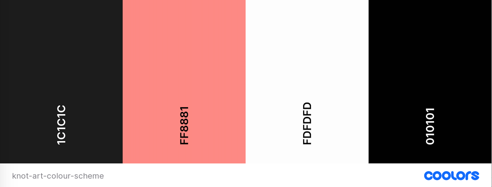

# Knot Art
---
*Note: this website was created for educational purposes as a student of Code Institute, and the website described below is a fictional one.*

Knot Art is an e-commerce website for a macrame artist to sell their small collection of exclusive hand-crafted macrame wall hangings. In addition they maintain a list of upcoming craft markets on the website where customers can buy in person. Customers can register with the site to create a profile where they can save upcoming in-person markets and view their order history.

[View the live website here](https://knot-art.herokuapp.com/). *Link opens in same tab, right click to open in a new tab.* 


## Table of Contents
---
- [Purpose](#purpose)
- [E-commerce Buisness Model](#e-commerce-buisness-model)
  * [E-commerce application type](#e-commerce-application-type)
  * [Features to be included](#features-to-be-included)
  * [Database tables and data required](#database-tables-and-data-required)
- [Search Engine Optimisation (SEO)](#search-engine-optimisation-seo)
- [Marketing](#marketing)
- [User Experience (UX)](#user-experience-ux)
  * [User stories](#user-stories)
  * [Design](#design)
  * [Wireframes](#wireframes)
- [Features](#features)
  * [Existing Features](#existing-features)
  * [Future Features](#future-features)
- [Content Requirements](#content-requirements)
- [Database Schema](#database-schema)
- [Project Structure](#project-structure)
- [Technology](#technology)
  * [Languages](#languages)
  * [Frameworks, Libraries, Programmes and Tools](#frameworks-libraries-programmes-and-tools)
- [Testing](#testing)
- [Deployment](#deployment)
  * [Gitpod - during development](#gitpod---during-development)
  * [Deployment to Heroku](#deployment-to-heroku)
  * [Forking the GitHub Repository](#forking-the-github-repository)
  * [Cloning the GitHub Repository](#cloning-the-github-repository)
- [Credits](#credits)
  * [Code](#code)
  * [Content](#content)
  * [Media](#media)
- [Acknowledgements](#acknowledgements)

## Purpose
---
The primary purpose of the website is for the website owner to sell their hand-crafted macrame wall hangings online. The secondary purpose is to keep customers informed of in-person craft markets where the wall hangings will be sold (where the customers can see the items before buying), and for the site owner to guage interest in these markets from their customer base.

### User’s goals:
- Buy a macrame wall hanging online
- See the upcoming markets where the wall hangings will be sold, so that they can plan to attend accordingly
- Create a profile so that they can save upcoming markets that they are interested in going to, comment on these markets and also see their order history and saved delivery details

### Site owner’s goals:
- Sell their macrame wall hangings via the website
- Maintain a list of upcoming in-person markets on the website so that 1) customers know about these in advance and can indicate that they want to attend by saving a market to their profile, 2) the site owner can see the level of interest from the customer base in the different markets

The target audience are people with an interest in using natural materials in their home, as well as those who appreciate hand-crafted items, people with an interest in textiles and textile art, or who are just looking for something different to decorate the walls in their home. The site owner is based in Dublin, Ireland and the in-person markets which are advertised on the site are based in and around Dublin, so in this context the target audience would be those based in and around the Dublin area. But in the e-commerce context, location is not a restricting factor since the products can be bought from anywhere in the world.

## E-commerce Buisness Model
---
The following section documents the planning process for the website, based on the type of e-commerce application it is, what products it is selling, and the customers it will have.

### E-commerce application type
This e-commerce application sells its products to customers who are individuals, therefore the  business model is a B2C (Business to Customer) one. The website will sell products (rather than services) and is based on a single payment model, i.e. the customer pays for the product and that completes the transaction, there are no ongoing fees or subscriptions. The model is a Direct to Consumer one, i.e. there are no third party intermediaries involved. 

These factors mean that the following need to be taken account in the design/planning of the website:
- customers, as individuals rather than businesses, might make impulse buys, 
- the decision making process is shorter and they can make their own choice to buy the product (i.e. they don't need to justify the expenditure to a manager etc. as would be the case in a B2B model). 
- therefore the steps the user needs to take to complete a purchase on the website should be as easy as possible and the design should take account of this. 
- since products are being sold, the database will need to store the details of these products
- the website will also need good quality images of the products, to show the customers what they are buying and to build trust in what they are buying
- there should be an ability for the customer to sort and filter products in the shop
- while customers may enjoy being able to buy these products online, since these are tactile products some customers may want to see and feel the product in 'real life' before buying
- as the payment is a single payment, customers would expect to receive a confirmation once they have completed their purchase

### Features to be included
Based on the above analysis, an initial overview of features that would be needed are listed below. The full list of features implemented are outlined in the [Existing Features](#existing-features) section.

- since this is direct to consumer, and the product is hand-crafted, the website should draw attention to this, e.g. by having a section about the maker, how the products are made, the materials used (this should follow into the product descriptions as well)
- the shop should contain high quality images for the products as well as descriptions of the products so users can easily make the decision to buy. As noted above, the product descriptions should include details such as materials used, or other details that emphasise the hand-crafted personal nature of the item
- the shop should allow users to sort and filter the products by relevant categories so customers can find what they are looking for
- the path to making the purchase should be as easy/seamless as possible to allow the customer complete the transaction
- there needs to be a shopping bag/cart functionality so that users can add items to the cart, view the cart and either go back to shopping or then complete the checkout process
- there needs to be a login and authentication mechanism for users, so they can view their details, order history. Anonymous checkout should also be allowed if users do not wish to create an account
- there needs to be a checkout process, and for registered users an option to use their saved delivery details for a quicker checkout
- for users who prefer to see/feel the product before buying, the website owner facilitates this through also selling the items at craft markets. The website should show details of these markets so that customers know when these are coming up
- for these users, the website should also allow them to save a market to their user profile, so when they are logged in they can see the one they've saved as a reminder
- in addition, to generate a sense of community and engagement, users can add comments to markets and thus interact with each other, hear others' opinions on a market or ask a question on a market
- customer loyalty is an important factor in direct to consumer, so there should also be a newsletter sign up, so that the site owner can keep customers up to date as well as links to social media profiles including Facebook business page

### Database tables and data required
Based on the above analysis, an initial overview of the tables that would be needed in the database, and type of data in these tables follows below. A full description of the data models can be found in the [Database Schema](#database-schema) section.

- a table for Users, to store information about users, such as name, email address, and password so that they can login
- a further UserProfile table can extend the above, to include additional information such as the saved delivery details
- a table for Products, storing information such as product name, description, price, image, article number/sku, the category it falls into
- the product category names could be stored in their own table for ease of administration (rather than a choices list). This table could store both the category name and a user friendly name for the frontend (e.g. for categories that contain an '&' in the name, which could not be stored in the database category name)
- a table will be required for Orders, to store the user, their delivery information, and order cost
- a linked table to this would be OrderLineItems which would be the individual items in an order and store the product information and quantity of that product
- for the markets a table will be needed to record the name, location, date, time, image, website, as well as a table to hold the comment details for each market
- a further table for the user SavedMarkets will record the user and the list of markets they have saved

## Search Engine Optimisation (SEO)
---
SEO is important for this (or any) business, so that the website can be found by search engines and rank in their results, so that users will actually find the website when searching for the relevant terms. There are two parts to this: determining the keywords that might be searched for, and using them in the website; and generating the files the search engines will use to crawl the website.

### Keywords
Keyword research was completed in order to determine which keywords to include in the website's content, image file names and alt text, headings, page titles and in the meta description and meta keywords. A mix of short and long tail keywords were identified (from brainstorming and using Google to find related searches), within the key topics for the website of macrame, wall/home decor and craft markets, and any that were not relevant or that the website doesn't have authority on were eliminated. Without having access to paid keyword planner websites, it is somewhat difficult to find alternative words for some of the most popular keywords, however this would be a future feature to be implemented if the business was a real business.

### Implementation of keywords
- The `meta` `description` and `keywords` tags were included in base.html, so that they are present for all pages. These were then tweaked on some pages to be more specific to those pages: 
  - the products page has specific meta description and meta keywords related to the products
  - in the product details page the product name is added to the meta description
  - the markets page has specific meta description and meta keywords (more keywords in relation to craft markets, than would be needed on other pages)
  - the market details page meta description includes the market name.
- The content throughout the website uses the keywords:
  - in the `h1` for the callout on the landing page
  - in the introductory text in the About Us section on the home page
  - in the product descriptions for each product in the shop
  - in the product names for each product in the shop
  - the `h1` on the products page
  - in the `title` for the shop and markets pages

- The content aims to be trustworthy, relevant, expert and authoratative. The website includes a Privacy Policy and Terms of Use documents for trustworthiness. The product and market images are high quality (bearing in mind these are sourced using free resources but would be professional images if this were a real business)
- The image file names for the products all reference key words, including the product characteristics e.g. 'cream-boho-bedroom-macrame-hanging.jpg'. Similarly for the markets the image file names include the market name. The alt text for the product and market images is set to use the name of the product or the market, which themselves are descriptive, so serves to describe the image and include keywords it the alt text.
- Links relating to external content that have nothing to do with the website content have the `rel="noopener"` attribute on them so that search engines do not include these links when ranking. In relation to linking to trusted external websites to improve the quality/ranking of the website, the markets page does include external links to each market, however these are dummy websites for the project but would be live ones if this were a real business. These would be high quality and relevant links. In the future the website could include a Blog page for the website owner to post about the different macrame knots, her making process, how to choose they right type of wall hanging, and these posts could include high quality external links as they would be relevant here. The Blog section may also help increase the dwell time on the site.
 
### sitemap.xml and robots.txt
The sitemap.xml was created to list all the page urls that can be accessed without logging in, this helps the search engines crawl the site. A robots.txt was created, listing the urls for search engines not to access (the listed urls are to do with account sign in, the bag and checkout process and the adding of products/marekts since these are not relevant for search results). The existence of the robots.txt file will help improve SEO ranking as it shows the website acknowledges that the search engines are allowed onto the site, so is an indicator of quality. Both files exist on the deployed site. *Note: since this is a project and not a live site for a real business (and hasn't been deployed to a custom domain), the last steps of registering the sitemap with Google and testing the robots.txt have not been done.* 

## Marketing
---
The first part of the marketing strategy for this business is ensuring that the webpage is optimised as far as possible in terms of search engines. The measures taken to address this are outlined above in the [Search Engine Optimisation (SEO)](#search-engine-optimisation-seo) section. The other marketing measures to be employed are explained below.

This is a small, one person business and its goals are to sell its macrame wall hangings both online and at craft markets. The website users are mainly female, ranging in age roughly from 20s to 60s. This age group uses social media and since the business sells art products, the most appropriate platform would be those with a more visual basis such as Instagram and Facebook (though the business will also set up profiles on Twitter and LinkedIn. TikTok will not be used at this stage as the audience is mainly younger, but this can be revisted in the future). As the business is new and does not have a budget for advertising or to employ someone to run a marketing strategy, it will focus on organic growth through Social Media Marketing. 

A Facebook Business page will be created which will promote the business, promote the products being sold, highlight the unique handcrafted nature of the products and highlight that people can buy easily online, but also at physical in person craft markets. This is a plus for customers since this is a tactile product and many customers may want to see and touch the item before buying it. The Facebook page will highlight this, and the website will have a section for users to save a market to their profile. The content on the Facebook page can be reused on the other social channels and can include:
- photos of the creation process
- posts alerting followers to new products, special offers, products now back in stock
- posts about the markets
- posts with photos from the markets on the day and other makers (build supportive community of other makers)
- posts aksing for user engagement such as a poll to see which colour they prefer for a new piece for example
- short videos showing snippets of the process of creating the wall hangings. These would not be tutorials (since the site users are not necessarily people who want to make the item themselves, the site wants to attract people to buy) but rather a glimpse into the 'behind the scenes' process which should help engage potential customers and emphasise the quality and uniqueness of the product.

During project development, the Facebook business page was created and the link added to the website foooter. The business details were added, with a Shop button, a link to the website, page description and a welcome post. However, as expected because the business doesn't exist, the page was taken down by Facebook so the link no longer works. In addition, [as you can see here](docs/facebook-cannot-use-url-warning.png), Facebook didn't allow the website link to be included in the welcome post. [Here is a screenshot of the Facebook business page](docs/facebook-business-page.png) before it was taken down.

As the business is small and new, content marketing will be employed mainly on the social media platforms and not yet on the website. However this will be an important element to include on the website as the business grows. Possible elements of content marketing that could be used include having a Blog section on the website with tips on how to choose the right wall hanging, the different type of knots and materials used (but staying away from tutorials), write ups on the different craft markets and what to expect at them. Videos of the making process could also be included on the website.

Email marketing is free (for the numbers this small business will initially have) and relatively easy to set up, so the business will use this too. The website will include a section in the footer to sign up to the newsletter. Building up a list of email subscribers through the newsletter sign up means the business will then have a pool of people who it knows are interested in its products (as they voluntarily signed up!) so are more likely to make a purchase. 

The business owner can use the newsletter to 
- highlight when new products have been added to the website,
- let subscribers know about the markets they'll be at (linking to the website so they can then save market details that they're interested in)
- let subscribers know when an item is back in stock on the website
- send out discount codes to thank the email subscribers for their loyalty and to entice them to buy

The business owner doesn't have to invest much time to manage the email marketing, and can try out different types of formats for the newsletter over time to see what works, so it is an easy strategy to get started with in the early days of the business. They need to ensure they are GDPR compliant by making it an opt in process (which it will be via the sign up form) and making it easy to unsubscribe - the link to unsubscribe should be in each email sent. The business will use [Mailchimp](https://mailchimp.com/) to manage the collection of email addresses and the sending out of newsletters. This service is free for up to 2,000 subscribers and also provides insights and analytics tools along with many guides and useful information to help users. 

## User Experience (UX)
---
### User stories
- #### Note on User Stories and Project Development:
  The project was developed using Agile methodology. A list of User Stories was defined at the project outset, they were refined and any that were too large would be broken into smaller stories. Further User Stories were added throughout the project. For each User Story, the process of refinement included defining the Acceptance Criteria to flesh out the expectations and then adding it to the Product Backlog. Then the Tasks from the development side were added. The Product Backlog was refined throughout the project and User Stories prioritised for the next iteration. Each User Story was given a story point value and a MoSCoW priority, before then being either added to the next Iteration, or left on the Product Backlog for future iterations. Each Iteration was completed and any user stories not completed in that iteration were moved back to the Product Backlog. The Product Backlog was updated continuously throughout the project, adding new user stories or issues to it as they were fleshed out with their acceptance criteria, and moving the prioritised user stories out of the Product Backlog and onto the next Iteration milestone.
  
  This was managed via GitHub as follows:
  - User Stories were recorded via Issues (a template was created) and GitHub labels were used for story points and MoSCoW priority level
  - Product Backlog created using Milestone
  - Iterations created using Milestone
  - The work for each Iteration was managed through a kanban board created using GitHub Projects
  
  All of the above can be seen in the GitHub repo, where you can see which User Stories or Issues were included in each Iteration. 

- #### List of User Stories:
The following are the user stories defined at the beginning of the project, and those added over the course of the project development. Each User Story below is linked to the relevant Issue on GitHub, where full details (acceptance criteria, tasks, story points, prioritisation, iteration and the history of same) can be seen. Note that Issues to do with bug fixes are not listed below (since they are not User Stories) but can be seen in the GitHub repo and the larger ones are detailed in the Bug fixes section of [TESTING.md](TESTING.md).

For ease of reading, the user stories around similar actions have been grouped into loose categories:

#### General, site purpose, navigation:
- [#1](https://github.com/Fiona-T/knot-art/issues/1) As a visiting user, I can easily find out what the purpose of the website is and learn more about the site owner and the products being sold, so that I  can decide to stay and browse or not
- [#2](https://github.com/Fiona-T/knot-art/issues/2) As a site user, I can navigate the site so that I can find the page I want to go to
- [#3](https://github.com/Fiona-T/knot-art/issues/3) As a site user, I can find the Knot Art social media accounts, so that I can follow them on social media to keep up to date
- [#4](https://github.com/Fiona-T/knot-art/issues/4) As a site user, I can sign up to the newsletter, so that I can stay informed  and stay engaged with the shop
- [#5](https://github.com/Fiona-T/knot-art/issues/5) As a site user, I can see a 'Page not found' page with consistent branding to the rest of the site, when I try to access a page in error, so that I can find my way back to the website and know I have not left the website
- [#6](https://github.com/Fiona-T/knot-art/issues/6) As a site user, I can find the terms of use and privacy policy so that I can read these documents and have trust in the site
- [#52](https://github.com/Fiona-T/knot-art/issues/52) As a user I can click on a back to top button so that I can get back to the top of the page without having to scroll
- [#53](https://github.com/Fiona-T/knot-art/issues/53) As a user I can see a message confirming my actions (e.g. adding item to bag) so that I know my changes were received
- [#62](https://github.com/Fiona-T/knot-art/issues/62) As a user I can see a page styled the same way as the website when I get a server error or access denied so that I can find my way back to the correct page on the website
- [#91](https://github.com/Fiona-T/knot-art/issues/91) As a user I can quickly see which section of the website I am in from the main header so that I know which part of the website I am in and can navigate easily

#### Shop - viewing products
- [#7](https://github.com/Fiona-T/knot-art/issues/7) As a site user, I can easily view all the products in the shop so that I can see all the available products immediately without having to sort or filter or take any action
- [#8](https://github.com/Fiona-T/knot-art/issues/8) As a site user, I can view an individual item details so that I can see the full details including the description and decide whether to buy
- [#9](https://github.com/Fiona-T/knot-art/issues/9) As a site user, I can select a specific category of product so that I can view just the items in that category to make it easier to make a decision
- [#10](https://github.com/Fiona-T/knot-art/issues/10) As a site user, I can sort the products in the shop so that I can find what I'm looking for more easily
- [#11](https://github.com/Fiona-T/knot-art/issues/11) As a site user, I can search for a product in the shop so that I can find a particular item quickly
- [#71](https://github.com/Fiona-T/knot-art/issues/71) As a user I can see the results for my filter option or search term so that I can quickly see how many products match my filter option/match my search term

#### Shop - adding to/updating the cart
- [#12](https://github.com/Fiona-T/knot-art/issues/12) As a site user, I can add an item to my cart so that I can buy it
- [#13](https://github.com/Fiona-T/knot-art/issues/13) As a site user, I can select the quantity of an item before adding to my cart, so that I can add multiple of that item at once
- [#14](https://github.com/Fiona-T/knot-art/issues/14) As a site user I can see the total amount currently in my cart at all times, so that I can keep track of how much I'll be spending
- [#15](https://github.com/Fiona-T/knot-art/issues/15) As a site user I can see the items in my cart at any time, so that I can check what I have already added to the cart
- [#16](https://github.com/Fiona-T/knot-art/issues/16) As a site user I can adjust the quantity of a particular item in the cart so that I can buy more or less of the item directly from the cart
- [#17](https://github.com/Fiona-T/knot-art/issues/17) As a site user, I can remove an item from my cart so that I do not have to buy it if I've changed my mind

#### Shop - payment and check out
- [#18](https://github.com/Fiona-T/knot-art/issues/18) As a site user, I can continue to the checkout process once I've decided on my purchase so that I can buy the items
- [#19](https://github.com/Fiona-T/knot-art/issues/19) As a site user, I can enter my delivery and payment details so that I can complete my purchase
- [#20](https://github.com/Fiona-T/knot-art/issues/20) As a site user, I can see the order summary while making payment so that I can still edit the details before payment if I made a mistake
- [#21](https://github.com/Fiona-T/knot-art/issues/21) As a registered user, I can save my delivery information when checking out so that it is saved to my profile for use with my next order
- [#22](https://github.com/Fiona-T/knot-art/issues/22) As a site user, I can see an order confirmation page so that I know that the order went through okay
- [#23](https://github.com/Fiona-T/knot-art/issues/23) As a site user, I can recieve an email confirmation of my order so that I have this confirmation for my records
- [#54](https://github.com/Fiona-T/knot-art/issues/54) As a user I can see a preview of my shopping cart when I make changes so that I can easily see the new cart
- [#57](https://github.com/Fiona-T/knot-art/issues/57) As a site owner I can ensure that an order is created once payment is made so that a customer does not make a payment, without an order being created in the database

#### Markets - viewing markets
- [#24](https://github.com/Fiona-T/knot-art/issues/24) As a site user, I can easily view all the upcoming markets so that I can plan if I want to attend one of the markets
- [#25](https://github.com/Fiona-T/knot-art/issues/25) As a site user, I can sort the markets list so that I can find what I'm looking for more easily
- [#26](https://github.com/Fiona-T/knot-art/issues/26) As a registered user, I can save a market that I want to go to, so that I don't forget about it as it will be in my profile
- [#27](https://github.com/Fiona-T/knot-art/issues/27) As a registered user, I can see if I have saved a market already when viewing the markets list, so that I know if it's already saved in my profile or not
- [#28](https://github.com/Fiona-T/knot-art/issues/28) As a registered user, I can remove a previously saved market from my profile so that it is no longer in my profile if I don't want to go to it
- [#60](https://github.com/Fiona-T/knot-art/issues/60) As a user I can select a county to filter the markets by so that I can easily see just the markets in that particular county
- [#80](https://github.com/Fiona-T/knot-art/issues/80) As a user I can see how many comments are on a market so that I can decide if I want to read them or not
- [#88](https://github.com/Fiona-T/knot-art/issues/88) As a website owner I can see how many users have saved a market so that I can get an idea of how popular it might be
- [#90](https://github.com/Fiona-T/knot-art/issues/90) As a user I can view markets that are in the past so that I can read the comments on them to get a feel for them if the market runs again

#### Markets - comments
- [#78](https://github.com/Fiona-T/knot-art/issues/78) As a registered user I can add a comment to a market so that I can share my views on a market with other users
- [#81](https://github.com/Fiona-T/knot-art/issues/81) As a user I can read all the comments on a market so that I can see other users' opinions/questions on that market
- [#84](https://github.com/Fiona-T/knot-art/issues/84) As a registered user I can edit a comment that I posted on a market so that I can correct the comment if needed
- [#85](https://github.com/Fiona-T/knot-art/issues/85) As a registered user I can delete a comment that I posted on a market so that I can remove it if I don't want others to see the comment or I posted it in error

#### User account set up, sign in and out
- [#29](https://github.com/Fiona-T/knot-art/issues/29) As a site user, I can sign up for an account, so that I can enjoy the benefits of having an account e.g. saving delivery info
- [#30](https://github.com/Fiona-T/knot-art/issues/30) As a site user, I want to receive an email confirmation when I register, so that I know my account registration was successful and secure
- [#31](https://github.com/Fiona-T/knot-art/issues/31) As a registered user, I can sign into my account so that I can access my profile
- [#32](https://github.com/Fiona-T/knot-art/issues/32) As a registered user, I can sign out of my account when finished, so that I know I am signed out securely
- [#33](https://github.com/Fiona-T/knot-art/issues/33) As a registered user, I can easily see if I am signed into my account or not, so that I know straight away if I need to sign in

#### User profile 
- [#34](https://github.com/Fiona-T/knot-art/issues/34) As a registered user, I can update my default delivery information in my profile, so that the updated details are recorded for future orders
- [#35](https://github.com/Fiona-T/knot-art/issues/35) As a registered user, I can see my previous orders in my profile, so that I can see all the orders I made and can find details of a previous order
- [#36](https://github.com/Fiona-T/knot-art/issues/36) As a registered user, I can see all the markets I saved and view their details so that I have access to this information
- [#37](https://github.com/Fiona-T/knot-art/issues/37) As a registered user, I can remove a previously saved market from my profile so that it is no longer in my profile if I don't want to go to it
- [#58](https://github.com/Fiona-T/knot-art/issues/58) As a registered user I can view details of a previous order so that I can check what was ordered and where it was delivered to
- [#61](https://github.com/Fiona-T/knot-art/issues/61) As a registered user I can sort the markets list in My Markets page so that I can find the market I'm looking for more easily
- [#74](https://github.com/Fiona-T/knot-art/issues/74) As a registered user I can filter my saved markets by county so that I can easily see just my saved markets in that particular county
- [#77](https://github.com/Fiona-T/knot-art/issues/77) As a registered user I can easily navigate within the My Account pages so that I understand what pages are available and can get to them easily and I know what page I am on

#### Admin for Shop page
- [#38](https://github.com/Fiona-T/knot-art/issues/38) As the website owner, I can view all the products in the shop, even if they are not active, so that I can see an overview of all products, and so that I can edit inactive products
- [#39](https://github.com/Fiona-T/knot-art/issues/39) As the website owner, I can add a new product to the shop, so that I can sell the product to customers
- [#40](https://github.com/Fiona-T/knot-art/issues/40) As the website owner, I can add a edit the details of a product in the shop, so that I can change the price, description etc. and customers will see the updated information
- [#41](https://github.com/Fiona-T/knot-art/issues/41) As the website owner, I can turn on or off the active flag on a product, so that I can add or remove it from appearing in the shop for customers when it is in/out of stock
- [#42](https://github.com/Fiona-T/knot-art/issues/42) As the website owner, I can delete a product, so that it will not appear in the shop if it was added in error
- [#43](https://github.com/Fiona-T/knot-art/issues/43) As a website owner I can access the Django admin site for the categories so that I can add, edit or delete categories from here and new products for these categories can be added to the shop
- [#51](https://github.com/Fiona-T/knot-art/issues/51) As a site owner I can access the Django admin site for the products so that I can view, edit, delete products from here as well as from the website
- [#56](https://github.com/Fiona-T/knot-art/issues/56) As a website owner I can see orders in the admin site so that I can access the order details and fulfil the orders
- [#66](https://github.com/Fiona-T/knot-art/issues/66) As a website owner I can add a product and the sku is created automatically so that the skus for the products are standardised and I do not have to manually add a sku
- [#70](https://github.com/Fiona-T/knot-art/issues/70) As a website owner I can have the sku of a product updated when the category is changed so that the sku of the product is reflects the new category
- [#82](https://github.com/Fiona-T/knot-art/issues/82) As a website owner I can see a label and helptext on the category dropdown in the product form so that I am clear on what to do for this field

#### Admin for Markets page
- [#44](https://github.com/Fiona-T/knot-art/issues/44) As the website owner, I can see all markets on the markets page including past ones, so that I can see an overview of all markets and see older markets as well as upcoming ones
- [#45](https://github.com/Fiona-T/knot-art/issues/45) As the website owner, I can add a new market to the markets page, so that customers are informed of the market
- [#46](https://github.com/Fiona-T/knot-art/issues/46) As the website owner, I can edit the details of a market in the markets page, so that customers will see the updated information
- [#47](https://github.com/Fiona-T/knot-art/issues/47) As the website owner, I can delete a market, so that it will not appear in the markets page if it was added in error
- [#59](https://github.com/Fiona-T/knot-art/issues/59) As a site owner I can access the Django admin site for Markets so that I can view, edit, delete markets from here as well as from the website
- [#64](https://github.com/Fiona-T/knot-art/issues/64) As a website owner I can edit the details of a past market so that I can still edit the details even though it is in the past
- [#67](https://github.com/Fiona-T/knot-art/issues/67) As a website owner I can add a new county or Dublin postcode so that I can then choose that option when adding a new market
- [#68](https://github.com/Fiona-T/knot-art/issues/68) As a website owner I can edit a county or Dublin postcode for markets so that the correct text appears for users
- [#69](https://github.com/Fiona-T/knot-art/issues/69) As a website owner I can delete a county or Dublin postcode so that it no longer appears as an option, if it was added in error
- [#89](https://github.com/Fiona-T/knot-art/issues/89) As a website owner I can view the comments on a market in the admin site so that I can edit or delete users' comments from here if needed for moderation purposes

#### Admin for User Profiles
- [#63](https://github.com/Fiona-T/knot-art/issues/63) As a site owner I can access the Django admin site for Profiles so that I can view user profiles and user's saved market lists

#### Marketing/SEO
- [#48](https://github.com/Fiona-T/knot-art/issues/48) As the website owner, I want my website to contain relevant keywords so that users searching for these keywords will be more likely to find my website in web search results
- [#49](https://github.com/Fiona-T/knot-art/issues/49) As the website owner I have a link to the Facebook business page on the website so that customers or visitors to the website can follow the facebook page and I can generate more business through the facebook page
- [#50](https://github.com/Fiona-T/knot-art/issues/50) As the website owner I have relevant keywords included in the webpage metadata so that it helps improve SEO so that users searching for these keywords can find my website
- [#86](https://github.com/Fiona-T/knot-art/issues/86) As a website owner I can have a sitemap.xml and robots.txt file created for the website so that search engines can crawl the essential pages of the site and therefore users can find the site when searching key terms in search engine searches

### Design
To allow the product images to shine, the website design is clean, with plenty of white space and uses colours sparingly.
- #### Colour scheme
The accent colour for the website is a coral pink, and a dark black is used as a background to this to provide good contrast. 
Colour palette:

- Eerie Black `#1C1C1C` is used for the header and is the main text colour and is used as background colour for some buttons 
- Congo Pink `#FF8881` is the brand colour and is used for the logo and menu items in the header. It is also used as an accent colour througout the site for button backgrounds or outlines, link underlines, form wrappers, etc.
- Black `#010101`, a slightly darker black than the header colour, is used for the footer background
- White `#FDFDFD` is used for text that appears on darker backgrounds e.g. on dark buttons or for active menu items in the header.

The colour combinations have all been checked for accessibility using the [WCAG Contrast Checker tool](https://chrome.google.com/webstore/detail/wcag-color-contrast-check/plnahcmalebffmaghcpcmpaciebdhgdf?hl=en) to meet at least level AA. 

The contrast checker extension was used during development to check the contrast as changes were made to the website. A further check was done at the end of the project on each page. All pages meet at least level AA using the [WCAG Contrast Checker browser extension tool](https://chrome.google.com/webstore/detail/wcag-color-contrast-check/plnahcmalebffmaghcpcmpaciebdhgdf?hl=en).

- #### Typography
[Lobster Two](https://fonts.google.com/specimen/Lobster+Two) is used for the logo font. The curves and hand-lettered style of this font mean it works well as the logo for this site selling handmade items. Its thickness also contrast well with the body text so it stands out as the logo. [Overpass](https://fonts.google.com/specimen/Overpass) is used throughout the rest of the website, with the different weights used to distinguish the headings and body text. This is a light, sans serif typeface that has been optimised for smaller sizes on-screen. The lightness of this font works well with the imagery of the handmade macrame wall hangings. 

### Wireframes
#### Desktop/Tablet
- [Home page](docs/wireframes/home-desktop.png)
- [Shop](docs/wireframes/shop-desktop.png)
- [Bag](docs/wireframes/bag-desktop.png)
- [Markets](docs/wireframes/markets-desktop.png)
- [My Profile](docs/wireframes/my-profile-desktop.png)
- [Products Admin](docs/wireframes/product-admin-desktop.png)
- [Markets Admin](docs/wireframes/market-admin-desktop.png)
- [Sign Up](docs/wireframes/sign-up-desktop.png)
- [Sign In](docs/wireframes/sign-in-desktop.png)

#### Mobile
- [Home page](docs/wireframes/home-mobile.png)
- [Shop](docs/wireframes/shop-mobile.png)
- [Bag](docs/wireframes/bag-mobile.png)
- [Markets](docs/wireframes/markets-mobile.png)
- [My Profile](docs/wireframes/my-profile-mobile.png)
- [Products Admin](docs/wireframes/product-admin-mobile.png)
- [Markets Admin](docs/wireframes/market-admin-mobile.png)
- [Sign Up](docs/wireframes/sign-up-mobile.png)
- [Sign In](docs/wireframes/sign-in-mobile.png)

[View all wireframes in pdf here.](docs/wireframes/wireframes-all.pdf)

## Features
---
### Existing Features
#### Header - Navigation bar
- Appears at the top of every page, fixed so that the navigation links are always available to the user
- Contains website name on the left, and Shop, Markets, My Account and Cart on the right
- On smaller mobile sizes, just the icons are shown and not the text underneath
- Website name links back to the home page
- Shop: links to the shop page, available to all users
- Markets: links to the markets page, available to all users
- My Account (called Sign In when not logged in) dropdown:
  - the icon for this menu item is outlined when not logged in and filled when logged in
  - when user is not logged in, contains Sign in/Sign up links
  - when user is logged in, contains links to My Profile, My Markets and Sign Out
  - when user is logged in as a superuser, contains links to My Profile, My Markets, Product Management, Markets Management and Sign Out
- Cart: 
  - the icon for this menu item is outlined when there are no items in the cart and filled when there are items in the cart
  - shows the total amount in the shopping bag at that time
  - links to the shopping bag page to view the bag/continue to checkout
- When a user is signed in, there is confirmation of this at the top of the header, along with the user name they are signed in under
- When not on the home page, the relevant menu icons/text is highlighted to show the user which section of the website they are on currently

#### Footer
- Appears on the bottom of every page, not fixed (so as not to take up too much screen space on smaller screens) but sticks to bottom of screen even if not enough content to push it down
- Contains newsletter sign up, social links, terms of use and privacy policy
- Newsletter sign up form: email address field + sign up button. Having an easy newsletter sign up means the site owner can build an email subscriber list which can be used for email marketing
- Social links: Facebook business page, as well as LinkedIn, Instagram and Twitter pages for Knot Art (these external links open in a new window). These pages are part of the brand's web marketing.
- Terms of Use and Privacy Policy links: are included to build on the trustworthiness of the site, which helps for SEO (Search Engine Optimisation) purposes and  so that users know they can trust the site and this helps for SEO purposes.

#### Home Page
- Consists of two section: 'landing section' and 'About us'
- Landing section:
  - hero image to invite the user into the site and give an idea of what the website sells
  - tagline along with two buttons for important actions:
  - Learn More button which links to the About us section
  - Shop Now button which links to the Shop page
- About Us section
  - as a website selling hand crafted items, this section is important as it will build user trust and engagement with the person who makes the items. The hand crafted and personal nature is a key feature of the products being sold and this section helps to get that across to the user, and make them feel they are buying a very individual item
  - short intro to the website owner and how she makes the products, materials used, etc. 
  - brief overview of the features on the website, with links to the shop page, the markets page, as well as invitations to register for an account and sign up to the newsletter

#### Sign Up Page
- Sign up form for a new user with the following mandatory fields: username, email address, password, confirm password
- Sign in button to submit the form
- User will then receive an email to complete the registration process
- Also contains a link to the Sign In page for users who have already registered

#### Sign In Page
- Sign in form for existing users with the following mandatory fields: username/email address, password
- Sign up button to submit the form
- User is redirected to the home page after signing in
- Also contains a link to the Sign Up page for users who have not yet registered

#### Shop Page
- This page displays the products that a user can purchase. The products displayed at any time, or how they are displayed, depends on the options the user has chosen from the menu bar, as explained below (default is all items shown)
- Menu bar at top of the page containing a search box and the category menu for users to filter by category
- Category menu: The options are All, Living Room, Bedroom, Minis. The default is All, and the currently selected option is underlined. This menu collapses to a hamburger icon at mobile size. Once an option other than All is chosen, then only the products in that category is displayed and the results of the filter are displayed below the page heading, e.g.: *5 products in 'Living Room'*
- Search: user can enter text and search, the products displayed are those matching the search terms or none if there were no matches. The results of the search are shown below the page heading e.g.: *1 result found for 'yellow'* 
- Underneath the page heading is a select box with sorting options
- Sort by: price (high to low), price (low to high), product name (A - Z), product name (Z - A). Products are sorted by the option chosen, taking into account the previous filter or search terms applied (i.e. the sort works on the existing selection of products).
- Each product shows the product name, image, category, price
- For the admin user, there are additional links for Edit and Delete, as well as a button to either Make the product Active (if it is not active) or Make Inactive (if the product is active). 
- Admin user can see all products even if not active, whereas regular users will only see active products, as these are the products available for purchase
- Clicking on the product image will bring the user to the product detail page
- Clicking on the category for a product will filter the page by that category

#### Product Details Page
- The category menu and search box are shown at the top of the page, these options work as explained above and the results bring the user back to the shop page
- This page displays the product image, product name, category, price, detailed description
- Quantity selector with +/- buttons. 
  - The max quantity that can be selected is 10 and the min is 1. 
  - The + button is disabled once the input boxes reaches 10 and the - button is disabled when the input box is on 1 (so disabled on page load since it loads with a quantity of 1). 
  - The same goes for the up/down arrows inside the input box. 
  - If the user manually types in a number outside of this range then a validation message appears and the add to bag form doesn't submit. 
  - In addition, if the same item is already in the cart and the new quantity being added will bring the new total for that item above 10, then an error message is displayed and the item isn't added to the cart
- Add to Cart button - when clicked the product is added to the cart with the selected quantity and a notification displays once successfully added (or an error if the item was already in the cart, and the new quantity being added will bring total to above 10 for that item)
- Back to Shop button - when clicked brings the user back to the Shop page
- For the Admin user, this page also includes the Edit and Delete links, as well as the button to make the product active or inactive
- Clicking on the category will bring the user to the shop page, filtered by that category

#### Bag Page
- Displays the products currently in the user's cart, or a message if they have not added any items
- If there are products in the cart:
  - for each product the following are displayed: Product details (image + product name), Price, Quantity (inside a quantity input, with buttons to amend), Subtotal
  - Underneath quantity is a button to update the quantity (i.e. if the user has changed the quantity)
  - Underneath the item name is a button to remove the item from the bag
  - Underneath the listed products there is a bag total, then delivery charge (if applicable), and then Grand total 
  - the bottom of the page has two buttons: Back to Shop (brings user back to Shop page) and Go to Secure Checkout (brings user to the checkout page)
  - the totals summary + the Back/Checkout buttons are shown at the top of the page when on smaller screens, to avoid user having to scroll down if they want to go straight to checkout)
- If there are no products in the cart:
  - message stating you have not added any items to their bag
  - button to go back to the Shop page 

#### Checkout Page
- This page has two sections: Checkout, and Order Summary
- Checkout - consists of three sub-sections:
  - Your details: name, email, phone number (all mandatory)
  - Delivery details: 
    - Street Address 1 (mandatory), Street Address 2, Town or City (mandatory), County, Post Code, Country (mandatory - drop down list)
    - if user is logged in, checkbox to save these details to their profile
    - if user not logged in, note stating: sign in to save these details
  - Payment details: card number, expiry and CVC
  - Button at the bottom to complete the order along with confirmation of the amount they are paying
- Order Summary:
  - Shows the following details for each item: small image, name, quantity, subtotal
  - Underneath the listed products there is an order total, then delivery charge (if applicable), and then Grand total
  - button at the bottom to adjust the bag, brings user back to the Bag page

#### Order Confirmation Page
- This page is displayed after the Checkout form has completed successfully
- Order summary is displayed, and a message stating that a confirmation has been sent to the email address
- Order summary contains four sections:
  - order number and date
  - items in order: name of the product, quantity and price
  - delivery details: name, address details entered at checkout, phone number
  - billing info: order total, delivery, grand total, payment method
- Cart is now cleared and shows €0.00 underneath it in the header/icon is no longer filled
- Contains links to go to the Shop page

#### Markets Page
- This page displays the markets that the website owner will be selling at (in person), the user can save a market to their profile so as not to forget about it
- under the page heading is intro text explaining the page for users, with links to create an account (so markets can be saved) and to sign up to the newsletter
- for regular users or anonymous users, this page by default only shows the upcoming markets, those dated today or later, sorted by the earliest first
- for admin users this page shows all markets including those in the past, sorted by the newest first
- Under the intro text is a section with the viewing options:
  - sort by (market name A-Z, market name Z-A, by date: earliest to latest, by date: latest to earliest). Choosing an option sorts the markets by that option.
  - filter results showing results of filter by county, e.g.: *3 markets in Dublin 6*
  - filter by county - dropdown menu of the available counties for the markets currently being displayed (i.e. there is no county displayed that will give a result of 0 markets), as well as an option for All. The currently selected option is highlighted. Choosing an option filters the markets by that option.
- Each market shows an image, the market name, county, location, website (external link, opens in new tab), date and  times. The market image links to the market details page
- Clicking on the county for a market will filter the page by that county
- If the user is logged in, there is a button to save the market to their profile; or if they already saved it, then the button will be to remove the market from their profile
- If the user is not logged in, then there is a note stating to sign in/create an account in order to save the details
- Underneath the save button is a link to view the comments on this market. The text on the link changes depending on whether there are comments or not: 'be the first to comment' if there are none, or the number of comments if there are comments. 
- For the admin user, there are additional links for Edit and Delete
- For the admin user, two additional pieces of information are shown:
  - Status: either Upcoming or Date has Passed. Since the admin user can view all the markets, but this page is by default filtered to show upcoming markets only for regular users
  - Number of saves: the number of users that have saved this market to their saved markets

#### Markets Page - View Past Markets
This is a feature for regular users (not admin, since they can see all markets by default). This allows the regular users to view the older markets:
1. if they want to read comments on these markets, since the same market can run at a different date, so this market may run in the future and will be shown in the upcooming markets for the future date
2. so they can get a sense of what markets the owner is normally selling at, even if there is not yet a future date listed for that market (for example a market that runs every Chrismtas might not yet be listed in the upcoming markets early in the year, but the user can see it in the past markets so knows this might be listed again this year as an upcoming market)
- there is a button underneath the sort/filter options for View Past Markets
- clicking the button shows the user the past markets only, and the button text changes to 'View Upcoming Markets' so the user can get back to the default view
- when viewing past markets the functionality is the same as the Markets page default view (i.e. viewing upcoming markets), except:
  - each one is flagged with a status of Date has Passed
  - there is no save button
  - the intro text at the top of the page changes accordingly
  - the sort and filter options remain and will sort/filter the past markets only

#### Market Details Page
- This page has two sections: market details, and comments
- At the bottom of the page there is a button back to Markets page, or if the Market is in the user's saved market list, then a second button back to My Markets page
- Market details:
  - displays the market image (links to external website), market name, county, location, website, date and times
  - clicking on the county will bring the user to the markets page, filtered by that county
  - If the user is logged in, there is a button to save the market to their profile; or if they already saved it, then the button will be to remove the market from their profile (only shown if market date not in the past)
  - If the user is not logged in, then there is a note stating to sign in/create an account in order to save the details (only shown if market date not in the past)
  - For the admin user, there are additional links for Edit and Delete, as well as the Status and Number of Saves
  - If the user has saved this market and it is in the past, then the Status will be shown 
- Comments: 
  - Underneath the market details, with a heading of 'The Conversation' followed by the number of comments in brackets 
  - The comment form is shown first, this consists of a comment box and a button to post the comment. If the user is not logged in then the form is not shown but there is a note to log in/create an account in order to join in
  - The comments are shown next, or if no comments then a note that there are no comments yet
  - for each comment the username, date and time of comment and the comment is shown
  - if the user is logged in, and they posted the comment then there are links underneath the comment to Edit or Delete 
  - Adding a comment: the user can type in their comment and after clicking Post Comment they will see a success notification and the comment will be visible in the comments list
  - There is a cap on the maximum length of the comment, this is enforced at the client side (user cannot keep typing once they reach this max) but with an additional check at the server side, which will display an error notifcation and the comment will not be saved

#### Edit comment page
- This page is only available to a logged in user who posted the comment, and is accessed from the Edit link on the specific comment when viewing the comments on a market in the market details page
- The page consists of the comment form which is a single field for the comment, pre-populated with the existing comment
- The user can make the changes and then submit the updates, the same validation exists as on the Add Comment form

#### Delete comment modal
- This is only available to a logged in user who posted the comment, and is accessed from the Delete link on the specific comment when viewing the comments on a market in the market details page
- The modal is a pop up showing the comment details to check the user definitely wants to delete the comment
- There is a button to cancel, and a button to confirm the deletion

#### Profile Page
- This page is only available to a logged in user (accessed via My Account dropdown menu)
- At the top of the page there is a breadcrumb menu for the My Account pages, along with a button to go to My Markets
- consists of three sections: account details, order history, delivery details
- Order history: lists the previous online orders made through the website, or a note if there are none. Shows order number, date, items, total, listed with latest first.
  - the Order number links to a detailed view of the order
  - this page is the same as the Checkout Success page explained earlier, but the title of the page is Previous Order Details and the intro text confirms the date the order was placed
- Saved delivery details: 
  - displays the same delivery details as those on the checkout page. 
  - This is a form which will be blank if there are no saved details, or pre-populated with the previously saved details. 
  - The user can type in the amended details here and there is a button to save the changes
- Account details: 
  - displays the username and email address for the logged in account

#### My Markets Page
- This page is only available to a logged in user (accessed via My Account dropdown menu)
- At the top of the page there is a breadcrumb menu for the My Account pages, along with a button to go to My Profile
- Here the markets that the user saved from the Markets page are shown
- The same sorting (by name/date) and filtering (by county) options are available as explained on the Markets page
- Each market shows the same details as before on the general Markets page, but with an additional field showing the Status (upcoming or passed)
- On this page the save button text will be to remove the market from their list so that it no longer appears in this page
- The market image, or the comments link links to the Market Details page as explained above
- For the admin user they have the additonal information/links as explained on the Markets page

#### Admin pages - Products
- These pages are only available to a logged in admin user
- Add a product - this is accessed via the My Account dropdown menu Product Management
  - form to add a new product to the shop
  - fields (all mandatory except image): product name, price, category, description, image, tick box to set as an active product (i.e. appears in the shop, defaults to true), tick box to set New flag on product (defaults to true)
  - button to Add the Product, or Cancel button to abandon the process (brings user back to Shop page)
- Edit a product - accessed via the Edit link on the Shop page or the Product Detail page
  - form pre-populated with the existing details, same fields as for adding a product
  - button to Update Product or Cancel button to abandon the process (brings user back to Shop page)
- Delete a product - this is a modal, accessed via the Delete link on the Shop page or the Product Detail page
  - there is a note asking the user to confirm they definitely want to delete the product, and a reminder that they could edit the product to be in-active, if they don't want it to appear in the shop but don't want to delete it completely
  - button to Delete Product or Cancel button to abandon the process (brings user back to Shop page)

#### Admin pages - Markets
- These pages are only available to a logged in admin user
- Add a market - this is accessed via the My Account dropdown menu Markets Management
  - form to add a new market to the Markets page
  - fields (all mandatory except image): market name, location, county (dropdown) date, start time, end time, image, website
  - button to Add the Market, or Cancel button to abandon the process (brings user back to Markets page)
  - form validation is in place at client and server level for the following:
    - date cannot be before today
    - start time cannot be after end time/end time can't be before start time
- Edit a market - accessed via the Edit link on the Markets page
  - form pre-populated with the existing details, same fields as for adding a market
  - if the user is editing a past market then there is an info box to alert them to this and the helptext on the date field changes accordingly. The user can edit the past market but for the date field the date can only be changed to a future date and not to a date in the past (but can be left at the existing past date)
  - button to Update Market or Cancel button to abandon the process (brings user back to Markets page)
- Delete a market - this is a modal, accessed via the Delete link on the Markets page
  - there is a note asking the user to confirm they definitely want to delete the market
  - if the market is in the past then the note advises that this market is not shown in the default Upcoming Markets view to users
  - button to Delete Market or Cancel button to abandon the process (brings user back to Markets page)

#### Confirmation messages for user actions
- Actions that the user takes are confirmed/acknowledged via messages at the top of the screen. Any errors resulting from these actions are also shown here.
- these are displayed for:
  - adding a product to a bag
  - editing the contents of the bag - updating quantity or removing an item
  - signing in/out
  - saving or removing a market to/from My Markets list
  - adding a comment to a market
  - editing or deleting own comment on a market
  - updating saved delivery details on profile
  - admin user adding a new product or market
  - admin user editing or deleting a product or market
- when there are items in the bag, and the user is on the product details or cart page, then the success message also shows a small summary of the bag contents, along with a note re amount left to spend to get free delivery, and a button to view the bag and go to checkout
- the bag summary is not shown for other actions as it is not relevant (e.g. saving a market etc.) and is not shown for error/warning/info messages.

### Future Features 

## Content Requirements
---
The content requirements for this project mainly consists of the product descriptions for each product. These were written by the developer, after the product images were sourced, so that the description could be based on the free images that could be sourced. The other content was text for the About Us section and the introductory text in the Markets page, again this was written by the developer. Please refer to the [Credits section](#credits) for credits on the imagery used.

## Database Schema
---
The datasets for the project are:
- product information: products displayed in Shop
- order information: items being purchased 
- user information: username, saved delivery info, saved markets
- markets information: markets that will be shown on Markets page, and comments on these markets

The data is organised using the following models:
- **User:** Django built in User model. For authentication and authorisaton
- **UserProfile:** to store extra information relating to the user, in this case their delivery details. 
  - extends the Django User model using a OneToOne relationship
  - an instance of this model will be created each time a User record is created
  - the delivery info fields can all be blank as a user does not have to save these details to their profile
  - delivery info can be saved/edited on the UserProfile record by the user either ticking the save delivery info checkbox on the Checkout form (which will create an instance of the UserProfile form and update the profile), or by updating the UserProfile form on the profile page
  - this is a ForeignKey in the Order model so that user can be attached to the order, and the order history can be retrieved.
- **Category:** Holds the categories for the products. 
  - friendly name is the name shown on the front end
  - name must be unique so as to avoid conflicts when filtering by category
  - admin user will create/edit/delete instances of this model via the Django admin site
- **Product:** holds the details of the products that will be displayed on the Shop page.
  - each product must have a category, Category is a ForeignKey (one to many) in the Product model
  - product name must be unique
  - a BooleanField called 'is_active' will be used to set a product as active or not. Only active products will be shown in the shop. The site owner can set this to False for a product, instead of deleting it. Since there is not yet any stock management built into this website, this is also a method by which the site owner can remove products from the website temporarily when they are out of stock, and show them again when they have made more of that item
  - another BooleanField called 'is_new' will be used to flag whether a product is new or not. The site owner will use this to highlight new products to customers, the flag can them be set to false after a time when they are no longer new
  - admin user will create instances of this model via the form on the add product page on the frontend. They will edit and delete from the links on each product in the Shop page also. (Shop page displays all products, not just active, to the admin user)
  - a method on this model will automatically generate the sku for each product instance
- **Order:** the details of an Order, delivery details, user, totals
  - instances of this model are created during the Checkout process
  - this model will have some methods to create the order_number, calcuate the order_total, delivery_cost and grand_total and works in conjunction with the OrderLineItem model
  - this model includes two fields which will be used during the webhook handling process with Stripe. During this process, a check is done to see if the order is already in the database, and if not then create it. Since the same customer can order the same item(s) on more than one occasion, there needs to be some unique fields to prevent the previous identical order being found as this new order. These fields are: 'original_cart', a TextField containing a json dump of the bag, and 'stripe_pid', the Stripe payment intent id from the order, which is unique.
- **OrderLineItem:** the individual items in the Order instance
  - Order is a ForeignKey (one to many) in this model (one order to many line items)
  - Product is a ForeignKey (one to many) in this model to access the product details (i.e. price, to calculate the line item total)
  - this model calculates the total for each line item, which is then used by the Order model to calculate order total etc.
- **County:** Holds the counties in Ireland for the markets that the website owner will post on the website.
  - this model was created to hold the existing counties in Republic of Ireland, along with the existing Dublin area postcodes. This is so that the markets can then be filtered by county by users, and since the list is quite long a model was used instead of a CHOICES list.
  - friendly name is the name shown on the front end
  - name must be unique so as to avoid duplicates/conflicts when filtering by county
  - admin user will create/edit/delete instances of this model via the Django admin site since this list will not change very often (only likely if a new Dublin postcode is added)
- **Market:** holds the details of the markets that will be displayed on the Markets page.
  - admin user will create instances of this model via the form on the add market page on the frontend. They will edit and delete from the links on each market in the Markets page also.
  - each market must have a county, County is a ForeignKey (one to many) in the Market model 
  - this model will have a property which will return whether the market date has passed or not (this is relevant for the superuser views, and for views where a user has saved that market, as they can view past markets so there will be a flag to show the market is in the past)
- **SavedMarketList:** holds the user and a list of the markets they have saved, to be used to display to the user the details of the markets they have saved inside their profile section of the website.   
  - market field has ManyToMany relationship with Markets models, as one user can save many markets, and one market can be saved by many users
  - when a registered user uses the Save button on the market in the Markets page, an instance of SavedMarketList is created, if one didn't exist for that user, and the market is added to it 
  - markets are added to the existing SavedMarketList instance when a registered user adds more markets using the Save button, or removed when they use the Remove button in on that market the Markets page or in the MyMarkets page
  - after using the Remove button to remove a market from the instance, if there are no more markets for that user then the SavedMarketList instance is deleted
- **Comment:** holds the details of the comments that users add to markets and are displayed on the market details page. 
  - registered users can create instances of this model via the comment form on market details page.
  - the comment form will just contain a comment field, the other three fields for author, market (ForeignKey to Market model) and created_on are set in the view
  - registered users can edit and delete their own comments only, via links on any of their own comments on the market details pages.

The details of each model, and relationships between them, are shown in the database schema below.


## Project structure
---
The project is developed using the Django framework and is structured under the following apps within the Django project:

### home
- To display the Home page. 
- This app does not have a model as it does not require any database information, this is a static page displaying information. 

### products
- To handle the viewing of products in the Shop page, as well as the creating, editing and deleting of products by the admin user
- Will have a Product model (product details) and Category model (product category names)
- pages:
  - Shop (displays all products, filter/sort options)
  - Product Details (displays individual product)
  - Add Product (add product form, admin user only)
  - Edit Product (edit product form, admin user only)

### cart
- To handle adding items to the shopping cart, adjusting quantity in the shopping cart and removing items. 
- There is no model in this app, however it will use the Product  model from the products app in its views
- pages:
  - Cart (displays items in the shopping cart)

### checkout
- To handle the checkout and payment process
- Will have an Order model (order delivery and amount details) and OrderLineItem model (details of each individual item in the order)
- This app will also use the Product and UserProfile models from the other apps in its views
- pages:
  - Checkout (delivery + payment form)
  - Order confirmation (success page after checkout, also used to display details of a previous order from the profile page)

### profiles
- To handle the user information - their saved delivery details and their order history, and the markets the user has saved
- Will have a UserProfile model which extends the Django User model using a OneToOne link, to store the extra information (delivery details)
- Will also have a SavedMarketList model for the markets the user saves, linked to the Markets model in the markets app
- This app also uses the Order model from checkout app to display the order history
- pages:
  - My Profile (displays/allows edits of saved delivery details and displays order history, registered user only)
  - My Markets (displays/allows removal of user saved markets, registered user only)

### markets
- To handle the viewing of markets in the Market page, as well as the creating, editing and deleting of markets by the admin user
- To handle creating, viewing, editing and deleting of comments added by registered users on the markets
- Will have a Markets model to hold the market details, and a County model to hold the counties and Dublin area postcodes that the markets can be categorised into. Also a Comment model for the registered user comments on markets.
- pages:
  - Markets (displays all markets, filter/sort options)
  - Market Details (display an individual market, along with its comments and the form to add new comments - form only displayed for registered users)
  - Add Market (add market form, admin user only)
  - Edit Market (edit market form, admin user only)
  - Edit Comment (edit comment form, registered user only)

## Technology
---
### Languages
- HTML
- CSS
- JavaScript
- Python (with Django framework)
- Django templating language

### Frameworks, Libraries, Programmes and Tools
- [Balsamiq](https://balsamiq.com/) to design the wireframes
- The fonts used in the project are imported from [Google Fonts](https://fonts.google.com/)
- [Eye Dropper](https://eyedropper.org/) extension for Chrome to pick and generate colours for the project
- [Coolors](https://coolors.co/) to generate a colour palette/see how colours worked beside each other
- [Webaim Contrast Checker](https://webaim.org/resources/contrastchecker/) to check the contrast for the colour choices
- [tiny png](https://tinypng.com/) to compress the images
- [tempmailo](https://tempmailo.com/) for temporary emails when creating test users
- Git for version control, using the [Gitpod](https://www.gitpod.io/) terminal to commit to Git and push to GitHub
- [GitHub](https://github.com/) to store the project code
- [GitHub](https://github.com/) Issues, Boards and Milsetones features were used as Agile tools in the planning and implementation of the project through the lifecycle
- [Heroku](https://www.heroku.com/) to host the live application
- [Heroku Postgres](https://www.heroku.com/postgres) is the database for the deployed project
- [SQLLite](https://www.sqlite.org/index.html) the local development database
- [AWS](https://aws.amazon.com/) to host media and static files.
- The project is built using the [Django web framework](https://www.djangoproject.com/)
- [Stripe](https://stripe.com/ie) for handling payments (currently only set up to handle test payments)
- [Gmail](https://www.google.com/intl/en-GB/gmail/about/) to send emails
- [Bootstrap v4.4.1](https://getbootstrap.com/docs/4.4/getting-started/download/) for responsiveness, layout, modals, and general styles on the frontend
- [jQuery](https://jquery.com/) in some of the JavaScript files for ease of use
- [json formatter](https://jsonformatter.curiousconcept.com/#) to format the database data downloaded from the development database, so that fixures files could be created to import to the production database
- [django-allauth](https://django-allauth.readthedocs.io/en/latest/index.html) for user registration and authentication
- [Django countries](https://github.com/SmileyChris/django-countries#template-tags) for countries dropdown list in checkout form
- [Django Crisy Forms](https://django-crispy-forms.readthedocs.io/en/latest/) for rendering and styling of forms
- [miniwebtool](https://miniwebtool.com/django-secret-key-generator/) to generate secret keys
- [Bootstrap Icons](https://icons.getbootstrap.com/) for the icons used throughout the site
- [Chrome Dev Tools](https://developer.chrome.com/docs/devtools/) during development and testing to fix issues with the code and check for responsiveness/different device sizes
- [W3C HTML validator](https://validator.w3.org/) to validate the HTML code
- [W3C CSS Validator](https://jigsaw.w3.org/css-validator/) to validate the CSS code
- [JSHint](https://jshint.com/) to check the quality of and check for errors in the JavaScript code
- [PEP8](http://pep8online.com/) checker to validate the Python code
- [Coverage.py](https://coverage.readthedocs.io/en/6.2/index.html) for checking the level of coverage for the automated python tests
- [Formito](https://formito.com/tools/favicon) to make the favicon
- [Privacy Policy Generator](https://www.privacypolicygenerator.info/) to make the Privacy Policy
- [Terms and Conditions Generator](https://www.termsandconditionsgenerator.com/) to make the Terms of Use document
- [Mailchimp](https://mailchimp.com/) for the newsletter sign up form in the site footer
- [Facebook](https://www.facebook.com/) to create the Facebook business page (however note this was taken down by Facebook shortly after creation because it was not for a real business)
- [Lucidchart](https://www.lucidchart.com/pages/) to create the database schema diagram
- [Am I Responsive](http://ami.responsivedesign.is/#) to generate the mockup image showing the project on different devices
- [XML-Sitemaps.com](https://www.xml-sitemaps.com/) to generate the sitemap

## Testing
---
The testing section is contained in a separate file [which you can read here: TESTING.md](TESTING.md).

## Deployment
---
### Gitpod - during development
Gitpod was used as the development environment, with GitHub for version control and hosting the repository. The repository for this project, and the associated workspace, was created from the [Code Institute student tempate](https://github.com/Code-Institute-Org/gitpod-full-template). 
-   During development, code was written in the Gitpod workspace and changes to the frontend were previewed by opening the browser via the terminal in Gitpod, using the command `python3 manage.py runserver` and then selecting the Open Browser button when the following message appeared: "a service is available on Port 8000".
- Libraries/Frameworks used in the application were installed by typing the relevant install command (as per documentation) in the terminal, e.g. `pip3 install django`, where Django is the name of the framework being installed
-   Files and code were added to the staging area in Gitpod using the command `git add .` and commited using `git commit -m "commit message"`. 
-   Commited changes were then pushed to GitHub using the `git push` command.

### Deployment to Heroku
The following steps show how to deploy the application to [Heroku](https://www.heroku.com/), using [AWS](https://aws.amazon.com/) to host media and static files. *Note:* these steps explain how you would do this, however some steps will be irrelevant if you are forking the repository as it will already contain settings.py file for example. You can also install the requirements in one go using the requirements.txt file instead of individually as explained below. The below steps are intended as a guide to explain how this project was deployed.

#### Initial set up in workspace:
Before deploying to Heroku, the initial set up and creation of the project and app need to be completed in the IDE, in this case Gitpod workspace. Do the following in the command line:
1. Install django `pip3 install Django==3.2` *Note: using version 3.2 of Django and not the latest version which is version 4.*
 and gunicorn: `pip3 install django gunicorn`
2. Install gunicorn for running the deployed website `pip3 install gunicorn`
3. Install supporting libraries - for postgres: `pip3 install dj_database_url pyscopg2`
4. Install any other required libraries/tools
5. Create the requirements.txt file: `pip3 freeze --local > requirements`. This creates the requirements.txt file with the above dependencies. Later on in development, any further dependencies that are installed can be added to the file using `pip3 freeze > requirements.txt`. Heroku will use this file to install the requirements when creating the application on Heroku.
6. Create the django project: `django-admin startproject projectname .`. The ` .` means create the project in the current directory
7. Create a `.gitignore` file at the top directory level and add `*.sqlite3` to it, so that any sensitive data in the development database doesn't get pushed to GitHub, and `*.pyc` and `__pycache__/` because the complied python code is not needed in version control
8. Create app: `python3 manage.py startapp appname`. 
9. Go to `settings.py` (this is located in the project folder) and add the appname to `INSTALLED_APPS` list
10. The creation of the app creates initial migrations for the model and these need to be migrated. Back in the commandline: `python3 manage.py migrate`

Repeat steps 8, 9 and 10 throughout development as you create further apps within the project. When models are created or updated during development, the changes also need to be made and migrated using `python3 manage.py makemigration` and `python3 manage.py migrate`. Remember you will need to do the migrations on the production database as well.
To view the local version of the project before deployment to heroku, use `python3 manage.py runserver`, and open the port 8000 when it pops up.

#### Create the app on [Heroku](https://www.heroku.com/) and attach the database:
1. Sign in to/create account on Heroku, and "create app". If you don't have an account, then set one up: Click the Sign up button in the header, fill out the form and Click Create Free Account when done. You will receive an email, click the link to confirm. Then you will be brought to page called SET YOUR PASSWORD. Enter password, click SET PASSWORD AND LOG IN. Will then show welcome page, click on CLICK HERE TO PROCEED, then click Accept to accept the terms of service. Then click on "Create new app". If you do have an account then Sign In to your account and go to the Dashboard. Click on "New" on the top right of the screen and then "Create new app"
2. Under App name, enter the name of the application. Note: the name must be unique, so you would not be able to name it the same as the already deployed version
3. Then choose the Region and click "Create app"
4. Attach the database: go to the Resources tab, Add-ons and then search for 'Heroku Postgres'. Add and choose e.g. Hobby Dev
5. Back in the workspace, create a new file called `env.py` to store the environment variables. The file should be in the top level directory, and it should also be added to the `.gitignore file` to ensure it does not get pushed to GitHub as it contains sensitive information
6. In env.py:
    - `import os`
    - `os.environ["SECRET_KEY"] = '`generate a secret key and paste it here`'`
7. Back in Heroku, go to Settings tab, Config Vars, click Reveal Config Vars. Add a new one called `SECRET_KEY` and paste in the value from the `env.py` file
8. In the workspace go to the `settings.py` file and do the following (no need if using this project's settings.py file):
    - add `import os` underneath where it says `from pathlib import Path`
    - underneath this, `import dj_database_url`
    - and then add a conditional statement to import the `env.py` when in the development environment. 
    ```python
    if os.path.isfile('env.py'): 
    import env
    ```
    This means the environment variables in `env.py` are used while in the development workspace, but if not in the development environment then it will use the ones set in Heroku. 
    - update the value for `SECRET_KEY` to get it from `env.py` or Heroku: `SECRET_KEY = os.environ.get('SECRET_KEY')`
    - update the `DATABASES` section so that it connects to Heroku Postgres database on the deployed site (where there is a DATABASE_URL config var), and to the development sqlite3 in the local environment:
    ```python
    if 'DATABASE_URL' in os.environ:
      DATABASES = {
              'default': dj_database_url.parse(os.environ.get('DATABASE_URL'))
          }
    else:
        DATABASES = {
            'default': {
                'ENGINE': 'django.db.backends.sqlite3',
                'NAME': BASE_DIR / 'db.sqlite3',
            }
        }
      ```
    When you need to connect to the Postgres database from the local development environment (e.g. to run migrations, create a superuser, etc.), you can adjust the above as needed so that you connect to Postgres. You will need to add the DATABASE_URL value to connect, but remember not to commit this to the repo as it should remain secret.

9. Attach to the Postgres database (adjust in settings.py as needed, and use the database_url key but do not commit it) and in the command line, make the migrations to the Heroku Postgres database: `python3 manage.py migrate`
10. Then import the data using the fixtures files. Repeat the following command, with appropriate file name for each fixture file (categories, products, counties, markets) to import the data to the Postgres database: `python3 manage.py loaddate filename`. Note the categories file must be imported before products, and counties before markets as they contain the foreign key information. 
11. After doing the above, revert the DATABASES settings back as shown in step 8 above, so that production is connected to Postgres and development attached to local sqllite3 database.

#### Add allowed hosts and create Procfile:
1. In `settings.py`, find the `ALLOWED_HOSTS` list and add the heroku appname to it: `ALLOWED_HOSTS = ['yourherokuappname.herokuapp.com', 'localhost']`. This is so that the Heroku hostname is recognised and Django will allow it to run the project
2. Create a file named `Procfile`, this must be at the top level directory
3. Inside the `Procfile` add `web: gunicorn projectname.wsgi`. This is so that Heroku knows how to run the project

#### Initial Deployment:
1. Add all the changes above, commit them and push them to GitHub using `git add`, `git commit -m "commit msg"` and `git push` commands in command line
2. Go to Heroku and in Config vars, add `DISABLE_COLLECTSTATIC` with a value of `1`, for the initial deployment.

**Note:** steps 3 and 4 below are not currently possible in Heroku due to a change as of 16th April 2022. Heroku have removed the functionality to deploy from the Heroku dashboard or to add automatic deployments. It is not clear if this functionality has been removed on a permanent or temporary basis, so the steps have been left below in case the functionality is restored in the future. Until the functionality is restored, these two steps must be done through the command line, as shown [in this section underneath steps 3 and 4](#to-do-the-above-steps-3-and-4-through-the-command-line-instead).

3. In the Deploy tab, go to Deployment method and click GitHub
    - If have not connected to GitHub previously:
        - Underneath, it will show a section called Connect to GitHub, with a button at the bottom called “Connect to GitHub”. Press this button.
        - A pop up will ask you to Authorize Heroku’s access to your GitHub – click to Authorize, then enter your password and Confirm Password
        - The pop up will close and in the Connect to GitHub section it will show your GitHub username and a box to search for the repository to connect to. 
    - If have already connected to GitHub you do not need to do the above and it should show your GitHub username and a box to search for the repo name as above
    - Enter the repo-name in the box and press Search
    - Underneath, it will display the repo: `yourGitHubUsername/your-github-repo-name`, then press "Connect"
    - Once connected it will then show: Connected to `yourGitHubUsername/your-github-repo-name` by `yourGitHubUsername`
4. Underneath the Connect section, there are two options "Automatic deploys" or "Manual deploy"
    - Automatic – future pushes to GitHub will mean Heroku automatically builds a new version of the app with the pushed changes
    - Manual – the app is not automatically updated with future pushes to GitHub but these can be manually made if needed.
    - click Deploy Branch. I deployed using Manual. The logs will show the dependencies and requirements being installed. When done, the page will refresh and say “Your app was successfully deployed” with a View button.

##### *To do the above steps 3 and 4 through the command line instead:*
- use command `heroku login -i` and enter you username and password when prompted. You will see confirmation in the terminal that you are logged in.
- if you are not sure of the app name, you can find this using the command `heroku apps` which will list them. Use your app name below where `knot-art` is used
- Set the remote for the app on heroku using command `heroku git:remote -a knot-art`. You should see confirmation that the remote has been set to the heroku remote for that app.
- Push to heroku to do the deployment, using command `git push heroku main` (when you push to the repo on github you will use command `git push origin main`)
- You will see the build log in the terminal and after it has completed it will confirm the deployment was done, with the version number and the url for the website

*The rest of the process is the same regardless of whether the deployment was done through Heroku dashboard or via the command line:*

5. In Heroku, Click the Open app (or View button if still in the Deploy tab in Heroku) to view the app – it opens in a new window. For the initial deployment the static and media files have not been used but the database information should be there.

#### To add AWS for hosting static and media files:
If you don't have an account, create one, if you do log in. 
##### Create Bucket to store the files:
1. From services, go to S3 and Buckets, and Create bucket
2. Type in the name of the bucket (keep it similar to project name to avoid confusion), select the region, uncheck 'block all public access' (it needs to be public to access the static files) and Create the bucket
3. Go to Properties tab, scroll down to 'Static website hosting', click Edit. Select 'Host a static website', fill in default index.html and error.html (we won't be using these) and press Save
4. Then go to the Permissions tab and scroll down to 'Cross-origin resource sharing (CORS)'. Click Edit and paste in the following:
`[
    {
        "AllowedHeaders": [
            "Authorization"
        ],
        "AllowedMethods": [
            "GET"
        ],
        "AllowedOrigins": [
            "*"
        ],
        "ExposeHeaders": []
    }
]`
5. Still in Permissions, scroll to the 'Bucket policy' section and select 'Policy generator' (opens in a new tab). In the Policy Type, select 'S3 Bucket Policy'. In Principal, type in * (to all all). In the Action dropdown, select 'Get Object'. And in Amazon Resources Name (ARN), paste in the code from the other tab, it will look like: `arn:aws:s3::your-bucket-name`. Then click 'Add Statement'. Then click 'Generate Policy'. Copy the code in the 'Policy JSON Document' and paste it into the Bucket policy editor window in the other tab. Before pressing save, add `/*` onto the end of the bucket ARN in the Resource key (this is to allow access to all resources in the bucket). Then click Save.

##### Create a user to access the bucket:
1. From services, go to IAM and User groups, and Create group
2. Give the group a name (e.g. `manage-knot-art` so it is clear it's related to this project and the bucket created earlier), click Create Group
3. Create the policy that will be used to access the bucket. In Permissions. click on 'Add permissions' and then 'Create inline policy'. Go to the JSON tab and click on 'Import managed policies'. In the search box, type in S3, then from the resulting list select 'AmazonS3FullAccess' and press Import. In the JSON box, update the "Resource" key so that we allow access to just the bucket and everything in it. Update it from `"Resource": "*"` to the below, using the ARN:
```json
"Resource": [
                "arn:aws:s3:::bucket-name",
                "arn:aws:s3:::bucket-name/*"
            ]
```
Then click 'Next: Tags', then 'Next:Review', then give the policy a Name and Description, then click Create Policy.
4. Then go to User Groups, choose the group created in step 2, then in the Permissions tab choose Add Permission and Attach policies. Find the policy just created in step 3, and click Add Permission.
5. Then go to the Users page (from the side menu), click Add Users. Fill in the User name (e.g. knot-art-static-files-user) and click the option for 'Access key - Programmatic access', click Next, add the user to the group created in step 2, click the next buttons until you get to Create user
6. Download the csv file which contains the access key and secret access key for this user. Make sure to download as it won't be available again

##### Upload media files to AWS:
1. In AWS, go to S3 and locate the bucket created earlier. Create a new folder called 'media' inside the bucket. 
2. Inside this folder, click Upload and select the media files (download them from GitHub) to upload - these are the product images, market images, and home page images.

##### Add settings and environment variables for S3:
1. Back in the workspace, install boto3 and django-storages: `pip3 install boto3` `pip3 install django-storages`, update `requirements.txt` and in `settings.py` add `'storages' `to the `INSTALLED_APPS`
2. Go to `settings.py` and add the following (no need to do so if using this project's settings.py file):
``` python
if 'USE_AWS' in os.environ:
    AWS_STORAGE_BUCKET_NAME = 'bucket-name'
    AWS_S3_REGION_NAME = 'your bucket region'
    AWS_ACCESS_KEY_ID = os.environ.get('AWS_ACCESS_KEY_ID')
    AWS_SECRET_ACCESS_KEY = os.environ.get('AWS_SECRET_ACCESS_KEY')
    AWS_S3_CUSTOM_DOMAIN = f'{AWS_STORAGE_BUCKET_NAME}.s3.amazonaws.com'

    STATICFILES_STORAGE = 'custom_storages.StaticStorage'
    STATICFILES_LOCATION = 'static'
    DEFAULT_FILE_STORAGE = 'custom_storages.MediaStorage'
    MEDIAFILES_LOCATION = 'media'

    STATIC_URL = f'https://{AWS_S3_CUSTOM_DOMAIN}/{STATICFILES_LOCATION}/'
    MEDIA_URL = f'https://{AWS_S3_CUSTOM_DOMAIN}/{MEDIAFILES_LOCATION}/'

```
This tells Django which bucket to communicate with, where the static files will be coming from in production (the bucket name followed by .s3.amazonaws.com), to use S3 to store the static files when collectstatic is run, and to store uploaded images in S3 (references custom_storages.py which outlines these locations)
3. In Heroku, add `Config vars` for `AWS_ACCESS_KEY_ID` (value from csv file downloaded earlier), `AWS_SECRET_ACCESS_KEY` (value from csv file downloaded earlier), and `USE_AWS` (set to True so that the above settings are used in production). 

#### To add Stripe for payments:
This project uses Stripe to handle payment processing (currently set up for test payments only). Stripe can be set up as follows:
1. Go to [Stripe](https://stripe.com/ie) and Sign up for an account, or Sign in if you already have one
2. Go to the developers dashboard and from the menu at the side, select API keys. Underneath Standard Keys you will see a `Publishable key` and a `Secret key` (note you can toggle between Test and Live keys. This project is currently set up with test keys and would need to be switched over to live keys if it was being launched as a live shop)
3. Add the following to your `env.py`:
    ```python
    os.environ['STRIPE_PUBLIC_KEY'] = 'replace this with Publishable key from Stripe'  
    os.environ['STRIPE_SECRET_KEY'] = 'replace this with Secret key from Stripe'
    ```
4. Add the same variables to the Heroku Config Vars
5. In the project `settings.py` add the below:
    ```python
    STRIPE_CURRENCY = 'eur'  # or change to appropriate currency
    STRIPE_PUBLIC_KEY = os.getenv('STRIPE_PUBLIC_KEY', '')
    STRIPE_SECRET_KEY = os.getenv('STRIPE_SECRET_KEY', '')
    ```
6. This is enough to get payments set up (in test) at a basic level, see below for webhooks

This project is set up to listen for and handle webhooks from Stripe so that if e.g. a payment is processed on Stripe but the checkout form process on the website didn't complete, the order will still be created in the database for the payment processed on Stripe

7. To set up an endpoint for a webhook on Stripe, go to Webhooks from the Developers menu and click Add Endpoint
8. Add the checkout page webhook url, in this case it would be `https://knot-art.herokuapp.com/checkout/wh/`
9. For the events to send, select `payment_intent.succeeded` and `payment_intent.payment_failed`
10. Copy the signing secret for the webhook and then go to `env.py` and add it as the value for a new environment variable: `os.environ['STRIPE_WH_SECRET'] = 'replace this with webhook key from Stripe'`
11. Add the same to Heroku Config vars
12. Update `settings.py` to retrieve the environment variable: `STRIPE_WH_SECRET = os.getenv('STRIPE_WH_SECRET', '')`

#### To add email service for sending emails:
This project uses [Gmail](https://www.google.com/intl/en-GB/gmail/about/) to send emails for account sign ups etc., and order confirmation emails in production. (Emails are printed to the terminal in development.) Gmail for sending emails can be set up as follows:
1. Either create an account or sign into Gmail and go to Settings, then 'Accounts and Import' and then 'Other Google Account Settings'
2. Go to the Security tab and under Signing into Google, select to turn on 2-Step Verification, follow the steps to verify yourself to turn this on
3. Now under this same heading there will be a new option called App passwords, click on this (may need to enter password again) and set up the new app password: under 'select app' choose Mail and under 'select device' choose other and enter a name, e.g. Django, or something simialar, to identify this password. Then click on GENERATE
4. The next screen will show the app password for the device, copy this
5. In Heroku config vars, add two new variables of `EMAIL_HOST_PASS`, value will be the app password copied above and `EMAIL_HOST_USER`, with a value equal to the email address that you set the app password on. (These variables are not needed in env.py because this is for production emails only)
6. In settings.py, add the below to get the Gmail account and app password set up to send emails in production, and print emails to the terminal in development (this assumes there is a `DEVELOPMENT` variable in development environment and no such variable in Heroku):
    ```python
    if 'DEVELOPMENT' in os.environ:
        EMAIL_BACKEND = 'django.core.mail.backends.console.EmailBackend'
        DEFAULT_FROM_EMAIL = 'dummyemailaddress@example.com'
    else:
        EMAIL_BACKEND = 'django.core.mail.backends.smtp.EmailBackend'
        EMAIL_USE_TLS = True
        EMAIL_PORT = 587
        EMAIL_HOST = 'smtp.gmail.com'
        EMAIL_HOST_USER = os.environ.get('EMAIL_HOST_USER')
        EMAIL_HOST_PASSWORD = os.environ.get('EMAIL_HOST_PASS')
        DEFAULT_FROM_EMAIL = os.environ.get('EMAIL_HOST_USER')
    ```

#### Further Deployments during Development and for Final Deployment:
During development for future deployments:
1. Ensure `DEBUG` in `settings.py` is set to `False` (or to `'DEVELOPMENT' in os.environ`, if you have a `DEVELOPMENT` environment variable in your env.py and no such variable in the Heroku Config vars)
2. Ensure all changes are pushed to GitHub
3. In Heroku remove the `DISABLE_COLLECTSTATIC` config var once you have static files and have set up AWS bucket and user.
4. Follow steps 4 and 5 from the [Initial Deployment](#initial-deployment) section above to deploy and view the updated deployed app. *Note: if the Heroku dashboard doesn't have the option to connect to GitHub (functionality removed as of 16th April 2022 but may be reinstated), then follow the command line instructions outlined there instead.*

### Forking the GitHub Repository
The repository can be forked on GitHub, this creates a copy of the repository that can be viewed or amended without affecting the original repository. This can be done using the following steps:
1. Login to [GitHub](https://github.com/) 
2. Locate the relevant repository on GitHub. [This is the repository for Knot Art](https://github.com/Fiona-T/knot-art).
3. At the top right of the repository (under your avatar) locate the Fork button and click this button
4. You should now have a copy of the repository in your own GitHub account, to which you can make changes
5. To run the project locally, you will need to create an `env.py` file with the environment variables and install the requirements from the `requirements.txt` file using `pip3 install -r requirements.txt`

### Cloning the GitHub Repository
You can make a clone of the repository which will create a local copy on your own computer. Again you can make changes to this local copy that will not affect the original repository. Follow these steps to clone the Knot Art repository. 
1. Login to [GitHub](https://github.com/) and locate the repository as before
2. Click the button called Code, located to the left of the green Gitpod button
3. Under HTTPS copy the link provided (in this case https://github.com/Fiona-T/knot-art.git) 
4. Go to Gitpod or whichever IDE you are using and open the Terminal
5. Change the current working directory to the location where you want the cloned directory to be made
6. Type `git clone` followed by the url you copied in step 3:
`git clone https://github.com/Fiona-T/knot-art.git`
7. Press Enter to create the local clone
8. To run the project locally, you will need to create an `env.py` file with the environment variables and install the dependencies from the `requirements.txt` file using `pip3 install -r requirements.txt`

You can refer to the [GitHub documentation](https://docs.github.com/en/github/creating-cloning-and-archiving-repositories/cloning-a-repository) for more detailed information on the above process.

## Credits
---
### Code
### Content
- The full list of counties in the Republic of Ireland for the 'counties' dropdown list for adding/editing a market was sourced from [Wikipedia](https://en.wikipedia.org/wiki/List_of_Irish_counties_by_area)
- The list of Dublin postcode areas for the same dropdown list was sourced from [Wikipedia](https://en.wikipedia.org/wiki/List_of_Dublin_postal_districts#County_Dublin_(A41_%E2%80%93_K78))
- The description for each product in the shop was written by the developer
- It should be noted that the 'markets' listed in the Markets page are all fictional and as such the website urls are fictional also.
- Privacy Policy is from [Privacy Policy Generator](https://www.privacypolicygenerator.info/)
- Terms of Use document is from [Terms and Conditions Generator](https://www.termsandconditionsgenerator.com/)

### Media
- The hero image on the home page is by [Liligance](https://unsplash.com/@liligancephotography?utm_source=unsplash&utm_medium=referral&utm_content=creditCopyText) on [Unsplash](https://unsplash.com/photos/5zpH2y7v4aA)
- The image in the 'About Us' section on the home page is by [Ga](https://unsplash.com/@neringa?utm_source=unsplash&utm_medium=referral&utm_content=creditCopyText) on [Unsplash](https://unsplash.com/photos/RBerxXPnZPE)
- The 'image coming soon' image, used when a product or market has no image yet, is from [freeiconspng](https://www.freeiconspng.com/img/23499)
- Product images for the Shop page, and market images for the Markets page were sourced from [Pexels](https://www.pexels.com/search/macrame%20wallhanging/), [Unsplash](https://unsplash.com/s/photos/macrame-wallhanging) and [Pixabay](https://pixabay.com/images/search/macrame/)


## Acknowledgements
---
I would like to thank the following:
- my mentor Rohit Sharma for feedback and guidance throughout this project.
- the Code Institute Slack community for advice and support along the way