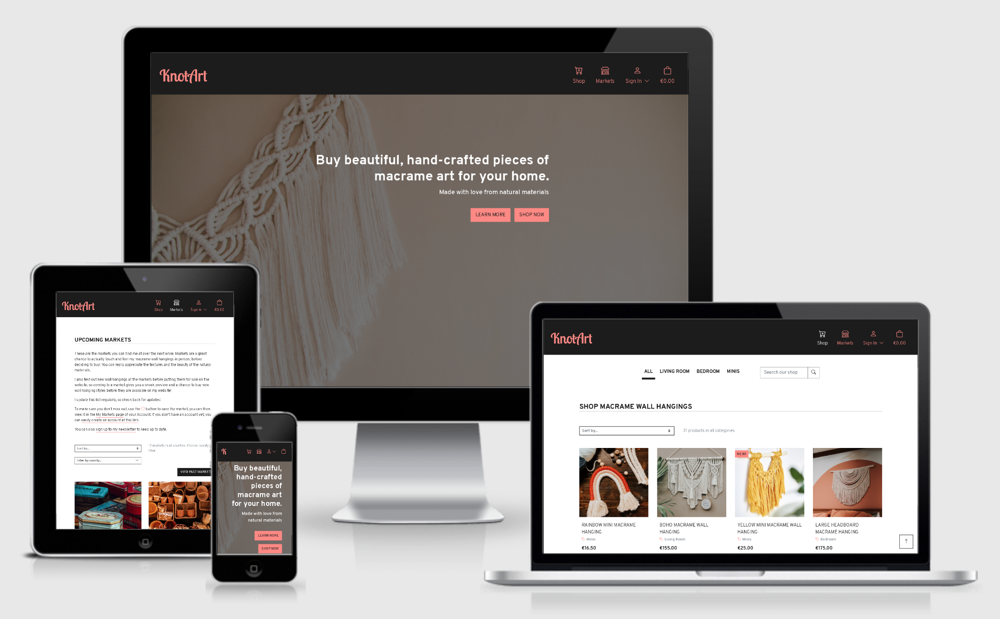

# Knot Art
---
*Note: this website was created for educational purposes as a student of Code Institute, and the website described below is a fictional one.*

Knot Art is an e-commerce website for a macrame artist to sell their small collection of exclusive hand-crafted macrame wall hangings. In addition they maintain a list of upcoming craft markets on the website where customers can buy in person. Customers can register with the site to create a profile where they can save upcoming in-person markets and view their order history.

[View the live website here](). *Link opens in same tab, right click to open in a new tab.* **Link to be added once site is deployed**

 *To be added*

## Table of Contents
---
- [Purpose](#purpose)
- [User Experience (UX)](#user-experience-ux)
  * [User stories](#user-stories)
  * [Design](#design)
  * [Wireframes](#wireframes)
- [Features](#features)
  * [Existing Features](#existing-features)
  * [Future Features](#future-features)
- [Content Requirements](#content-requirements)
- [Database Schema](#database-schema)
- [Project Structure](#project-structure)
- [E-commerce Buisness Model](#e-commerce-buisness-model)
- [Search Engine Optimisation (SEO)](#search-engine-optimisation-seo)
- [Marketing](#marketing)
- [Technology](#technology)
  * [Languages](#languages)
  * [Frameworks, Libraries, Programmes and Tools](#frameworks-libraries-programmes-and-tools)
- [Testing](#testing)
- [Deployment](#deployment)
  * [Gitpod - during development](#gitpod---during-development)
  * [Deployment to Heroku](#deployment-to-heroku)
  * [Forking the GitHub Repository](#forking-the-github-repository)
  * [Cloning the GitHub Repository](#cloning-the-github-repository)
- [Credits](#credits)
  * [Code](#code)
  * [Media](#media)
- [Acknowledgements](#acknowledgements)

## Purpose
---
The primary purpose of the website is for the website owner to sell their hand-crafted macrame wall hangings online. The secondary purpose is to keep customers informed of in-person craft markets where the wall hangings will be sold (where the customers can see the items before buying), and for the site owner to guage interest in these markets from their customer base.

### User’s goals:
- Buy a macrame wall hanging online
- See the upcoming markets where the wall hangings will be sold, so that they can plan to attend accordingly
- Create a profile so that they can save upcoming markets that they are interested in going to, and also see their order history

### Site owner’s goals:
- Sell their macrame wall hangings via the website
- Maintain a list of upcoming in-person markets on the website so that 1) customers know about these in advance and can indicate that they want to attend by saving a market to their profile, 2) the site owner can see the level of interest from the customer base in the different markets

## User Experience (UX)
---
### User stories
### Design
- #### Colour scheme
- #### Typography

### Wireframes
#### Desktop/Tablet
- [Home page](docs/wireframes/home-desktop.png)
- [Shop](docs/wireframes/shop-desktop.png)
- [Bag](docs/wireframes/bag-desktop.png)
- [Markets](docs/wireframes/markets-desktop.png)
- [My Profile](docs/wireframes/my-profile-desktop.png)
- [Products Admin](docs/wireframes/product-admin-desktop.png)
- [Markets Admin](docs/wireframes/market-admin-desktop.png)
- [Sign Up](docs/wireframes/sign-up-desktop.png)
- [Sign In](docs/wireframes/sign-in-desktop.png)

#### Mobile
- [Home page](docs/wireframes/home-mobile.png)
- [Shop](docs/wireframes/shop-mobile.png)
- [Bag](docs/wireframes/bag-mobile.png)
- [Markets](docs/wireframes/markets-mobile.png)
- [My Profile](docs/wireframes/my-profile-mobile.png)
- [Products Admin](docs/wireframes/product-admin-mobile.png)
- [Markets Admin](docs/wireframes/market-admin-mobile.png)
- [Sign Up](docs/wireframes/sign-up-mobile.png)
- [Sign In](docs/wireframes/sign-in-mobile.png)

[View all wireframes in pdf here.](docs/wireframes/wireframes-all.pdf)

## Features
---
### Existing Features
#### Header - Navigation bar
- Appears at the top of every page, fixed so that the navigation links are always available to the user
- Contains website name on the left, and Shop, Markets, My Account and Cart on the right
- Website name links back to the home page
- Shop: links to the shop page, available to all users
- Markets: links to the markets page, available to all users
- My Account:
  - when user is not logged in, contains Sign in/Sign up links
  - when user is logged in, contains links to My Profile, My Markets and Logout
  - when user is logged in as a superuser, contains links to My Profile, Product Admin, Market Admin and Logout
- Cart: 
  - shows the total amount in the shopping bag at that time
  - links to the shopping bag page to view the bag/continue to checkout

#### Footer
- Appears on the bottom of every page, not fixed (so as not to take up too much screen space on smaller screens) but sticks to bottom of screen even if not enough content to push it down
- Contains newsletter sign up, social links, terms of use and privacy policy
- Newsletter sign up form: email address field + sign up button. Having an easy newsletter sign up means the site owner can build an email subscriber list which can be used for email marketing
- Social links: Facebook business page, as well as Instagram and Twitter pages for Knot Art (these external links open in a new window). These pages are part of the brand's web marketing.
- Terms of Use and Privacy Policy links: are included to build on the trustworthiness of the site, which helps for SEO (Search Engine Optimisation) purposes and  so that users know they can trust the site and this helps for SEO purposes.

#### Home Page
- Consists of two section: 'landing section' and 'About me'
- Landing section:
  - hero image to invite the user into the site and give an idea of what the website sells
  - tagline along with two buttons for important actions:
  - Learn More button which links to the About me section
  - Shop Now button which links to the Shop page
- About Me section
  - as a website selling hand crafted items, this section is important as it will build user trust and engagement with the person who makes the items. The hand crafted and personal nature is a key feature of the products being sold and this section helps to get that across to the user, and make them feel they are buying a very individual item
  - short intro to the website owner and how she makes the products, materials used, etc. 
  - brief overview of the features on the website, with links to the shop page, the markets page, as well as invitations to register for an account and sign up to the newsletter

#### Sign Up Page
- Sign up form for a new user with the following mandatory fields: username, email address, password, confirm password
- Sign in button to submit the form
- User will then receive an email to complete the registration process
- Also contains a link to the Sign In page for users who have already registered

#### Sign In Page
- Sign in form for existing users with the following mandatory fields: username/email address, password
- Sign up button to submit the form
- User is redirected to the Shop page after signing in
- Also contains a link to the Sign Up page for users who have not yet registered

#### Shop Page
- This page displays the products that a user can purchase. The products displayed at any time, or how they are displayed, depends on the options the user has chosen from the menu bar, as explained below (default is all items shown)
- Menu bar at top of the page containing search box, sorting options and filtering options
- Search: user can enter text and search, the products displayed are those matching the search terms
- Sort by: price (high to low), price (low to high), product name (A - Z), product name (Z - A). Products are sorted by the option chosen.
- Filter by: category. Products displayed are only those in that category  
- Each product shows the product name, image, category, price
- For the admin user, there are additional links for Edit and Delete, as well as a field called Status (i.e. whether the product is active or not). 
- Admin user can see all products even if not active, whereas regular users will only see active products, as these are the products available for purchase
- Clicking on the product image will bring the user to the product detail page

#### Product Detail Page
- Displays the product image, product name, category, price, detailed description
- Quantity selector with +/- buttons
- Add to Cart button - when clicked the product is added to the cart and a notification displays beside the cart icon in the header
- Back to Shopping button - when clicked brings the user back to the Shop page
- For the Admin user, this page also includes the Edit and Delete links, as well as the status to indicate whether the product is active or not

#### Bag Page
- Displays the products currently in the user's cart, or a message if they have not added any items
- If there are products in the cart:
  - for each product the following are displayed: Product details (image + product name), Price, Quantity, Subtotal
  - Underneath quantity is a button to update the quantity (i.e. if the user has changed the quantity)
  - Underneath subtotal is a button to remove the product from the bag
  - Underneath the listed products there is a bag total, then delivery charge (if applicable), and then Grand total
  - the bottom of the page has two buttons: Back to Shop (brings user back to Shop page) and Go to Secure Checkout (brings user to the checkout page)
- If there are no products in the cart:
  - message stating you have not added any items to the cart
  - button to go back to the Shop page 

#### Checkout Page
- This page has two sections: Checkout, and Order Summary
- Checkout - consists of three sub-sections:
  - Your details: name, email, phone number (all mandatory)
  - Delivery details: 
    - Street Address 1 (mandatory), Street Address 2, Town or City (mandatory), County, State or Locality, Post Code, Country (mandatory - drop down list)
    - if user is logged in, checkbox to save these details to their profile
    - if user not logged in, note stating: sign in to save these details
  - Payment details: card number, expiry and CVC
  - Button at the bottom to complete the order
- Order Summary:
  - Shows the following details for each item: small image, name, quantity, subtotal
  - Underneath the listed products there is an order total, then delivery charge (if applicable), and then Grand total
  - button at the bottom to adjust the cart, brings user back to the Bag page

#### Order Confirmation Page
- This page is displayed after the Checkout form has completed successfully
- Order summary is displayed, and a message stating that a confirmation has been sent to the email address
- Cart is now cleared and shows €0.00 underneath it in the header
- Contains links to go to the Shopping page and Markets page

#### Markets Page
- This page displays the markets that the website owner will be selling at (in person), the user can save a market to their profile so as not to forget about it
- Each market shows an image, the market name, location, date, times and website (external link, opens in new tab). The market image also links to the external market website
- If the user is logged in, there is a button to save the market to their profile; or if they already saved it, then the button will be to remove the market from their profile
- If the user is not logged in, then there is a note stating to sign in/create an account in order to save the details
- For the admin user, there are additional links for Edit and Delete 

#### Profile Page
- This page is only available to a logged in user (accessed via My Account dropdown menu)
- At the top of the page there is a breadcrumb menu for the My Account pages
- consists of three sections: link to markets, order history, delivery details
- Saved markets: this is a link for the user to access My Markets page
- Order history: lists the previous online orders made through the website, or a note if there are none. Shows order number, date, items, total
- Saved delivery details: 
  - displays the same delivery details as those on the checkout page. 
  - This is a form which will be blank if there are no saved details, or pre-populated with the previously saved details. 
  - The user can type in the amended details here and there is a button to save the changes

#### My Markets Page
- This page is only available to a logged in user (accessed via My Account dropdown menu)
- Here the markets that the user saved to their profile from the Markets page are shown
- The user can sort them by date, and can filter by status (upcoming, or date has passed)
- Each market shows the same details as before on the general Markets page, and links to the external market website, but with an additional field called Status (upcoming or passed)
- Each market also has a button that the user can click to remove the market from their profile so that it no longer appears in this page

#### Admin pages - Products
- These pages are only available to a logged in admin user
- Add a product - this is accessed via the My Account dropdown menu
  - form to add a new product to the shop
  - fields (all mandatory): product name, price, category, description, image, tick box to set as an active product (i.e. appears in the shop, defaults to true)
  - button to Add the Product, or Cancel button to abandon the process (brings user back to Shop page)
- Edit a product - accessed via the Edit link on the Shop page or the Product Detail page
  - form pre-populated with the existing details, same fields as for adding a product
  - button to Update Product or Cancel button to abandon the process (brings user back to Shop page)
- Delete a product - this is a modal, accessed via the Delete link on the Shop page or the Product Detail page
  - there is a note asking the user to confirm they definitely want to delete the product, and a reminder that they could edit the product to be in-active, if they don't want it to appear in the shop but don't want to delete it completely
  - button to Delete Product or Cancel button to abandon the process (brings user back to Shop page)

#### Admin pages - Markets
- These pages are only available to a logged in admin user
- Add a market - this is accessed via the My Account dropdown menu
  - form to add a new market to the Markets page
  - fields (all mandatory): market name, location, date, start time, end time, website
  - button to Add the Market, or Cancel button to abandon the process (brings user back to Markets page)
- Edit a market - accessed via the Edit link on the Markets page
  - form pre-populated with the existing details, same fields as for adding a market
  - button to Update Market or Cancel button to abandon the process (brings user back to Markets page)
- Delete a market - this is a modal, accessed via the Delete link on the Markets page
  - there is a note asking the user to confirm they definitely want to delete the market
  - button to Delete Market or Cancel button to abandon the process (brings user back to Markets page)

#### Confirmation messages for user actions
- Actions that the user takes are confirmed/acknowledged via messages at the top of the screen
- these are displayed for:
  - adding a product to a bag
  - editing the contents of the bag - updating quantity or removing an item
  - signing in/out
  - saving or removing a market to/from profile
  - updating saved delivery details on profile
  - admin user adding a new product or market
  - admin user editing or deleting a product or market

### Future Features 

## Content Requirements
---

## Database Schema
---

## Project structure
---

## E-commerce Buisness Model
---

## Search Engine Optimisation (SEO)
---

## Marketing
---

## Technology
---
### Languages
### Frameworks, Libraries, Programmes and Tools

## Testing
---

## Deployment
---

## Credits
---
### Code
### Media

## Acknowledgements
---
