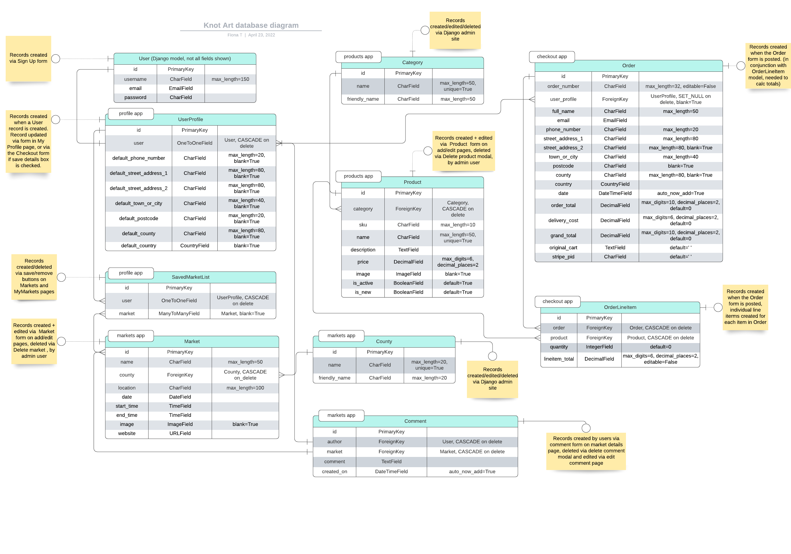

# Knot Art
---
*Note: this website was created for educational purposes as a student of Code Institute, and the website described below is a fictional one.*

Knot Art is an e-commerce website for a macrame artist to sell their small collection of exclusive hand-crafted macrame wall hangings. In addition they maintain a list of upcoming craft markets on the website where customers can buy in person. Customers can register with the site to create a profile where they can save upcoming in-person markets and view their order history.

[View the live website here](). *Link opens in same tab, right click to open in a new tab.* **Link to be added once site is deployed**

 *To be added*

## Table of Contents
---
- [Purpose](#purpose)
- [E-commerce Buisness Model](#e-commerce-buisness-model)
  * [E-commerce application type](#e-commerce-application-type)
  * [Features to be included](#features-to-be-included)
  * [Database tables and data required](#database-tables-and-data-required)
- [User Experience (UX)](#user-experience-ux)
  * [User stories](#user-stories)
  * [Design](#design)
  * [Wireframes](#wireframes)
- [Features](#features)
  * [Existing Features](#existing-features)
  * [Future Features](#future-features)
- [Content Requirements](#content-requirements)
- [Database Schema](#database-schema)
- [Project Structure](#project-structure)
- [Search Engine Optimisation (SEO)](#search-engine-optimisation-seo)
- [Marketing](#marketing)
- [Technology](#technology)
  * [Languages](#languages)
  * [Frameworks, Libraries, Programmes and Tools](#frameworks-libraries-programmes-and-tools)
- [Testing](#testing)
- [Deployment](#deployment)
  * [Gitpod - during development](#gitpod---during-development)
  * [Deployment to Heroku](#deployment-to-heroku)
  * [Forking the GitHub Repository](#forking-the-github-repository)
  * [Cloning the GitHub Repository](#cloning-the-github-repository)
- [Credits](#credits)
  * [Code](#code)
  * [Media](#media)
- [Acknowledgements](#acknowledgements)

## Purpose
---
The primary purpose of the website is for the website owner to sell their hand-crafted macrame wall hangings online. The secondary purpose is to keep customers informed of in-person craft markets where the wall hangings will be sold (where the customers can see the items before buying), and for the site owner to guage interest in these markets from their customer base.

### User’s goals:
- Buy a macrame wall hanging online
- See the upcoming markets where the wall hangings will be sold, so that they can plan to attend accordingly
- Create a profile so that they can save upcoming markets that they are interested in going to, and also see their order history

### Site owner’s goals:
- Sell their macrame wall hangings via the website
- Maintain a list of upcoming in-person markets on the website so that 1) customers know about these in advance and can indicate that they want to attend by saving a market to their profile, 2) the site owner can see the level of interest from the customer base in the different markets

The target audience are people with an interest in using natural materials in their home, as well as those who appreciate hand-crafted items, people with an interest in textiles and textile art, or who are just looking for something different to decorate the walls in their home. The site owner is based in Dublin, Ireland and the in-person markets which are advertised on the site are based in and around Dublin, so in this context the target audience would be those based in and around the Dublin area. But in the e-commerce context, location is not a restricting factor since the products can be bought from anywhere in the world.

## E-commerce Buisness Model
---
The following section documents the planning process for the website, based on the type of e-commerce application it is, what products it is selling, and the customers it will have.

### E-commerce application type
This e-commerce application sells its products to customers who are individuals, therefore the  business model is a B2C (Business to Customer) one. The website will sell products (rather than services) and is based on a single payment model, i.e. the customer pays for the product and that completes the transaction, there are no ongoing fees or subscriptions. The model is a Direct to Consumer one, i.e. there are no third party intermediaries involved. 

These factors mean that the following need to be taken account in the design/planning of the website:
- customers, as individuals rather than businesses, might make impulse buys, 
- the decision making process is shorter and they can make their own choice to buy the product (i.e. they don't need to justify the expenditure to a manager etc. as would be the case in a B2B model). 
- therefore the steps the user needs to take to complete a purchase on the website should be as easy as possible and the design should take account of this. 
- since products are being sold, the database will need to store the details of these products
- the website will also need good quality images of the products, to show the customers what they are buying and to build trust in what they are buying
- there should be an ability for the customer to sort and filter products in the shop
- while customers may enjoy being able to buy these products online, since these are tactile products some customers may want to see and feel the product in 'real life' before buying
- as the payment is a single payment, customers would expect to receive a confirmation once they have completed their purchase

### Features to be included
Based on the above analysis, an initial overview of features that would be needed are listed below. The full list of features implemented are outlined in the [Existing Features](#existing-features) section.

- since this is direct to consumer, and the product is hand-crafted, the website should draw attention to this, e.g. by having a section about the maker, how the products are made, the materials used (this should follow into the product descriptions as well)
- the shop should contain high quality images for the products as well as descriptions of the products so users can easily make the decision to buy. As noted above, the product descriptions should include details such as materials used, or other details that emphasise the hand-crafted personal nature of the item
- the shop should allow users to sort and filter the products by relevant categories so customers can find what they are looking for
- the path to making the purchase should be as easy/seamless as possible to allow the customer complete the transaction
- there needs to be a shopping bag/cart functionality so that users can add items to the cart, view the cart and either go back to shopping or then complete the checkout process
- there needs to be a login and authentication mechanism for users, so they can view their details, order history. Anonymous checkout should also be allowed if users do not wish to create an account
- there needs to be a checkout process, and for registered users an option to use their saved delivery details for a quicker checkout
- for users who prefer to see/feel the product before buying, the website owner facilitates this through also selling the items at craft markets. The website should show details of these markets so that customers know when these are coming up
- for these users, the website should also allow them to save a market to their user profile, so when they are logged in they can see the one they've saved as a reminder
- customer loyalty is an important factor in direct to consumer, so there should also be a newsletter sign up, so that the site owner can keep customers up to date as well as links to social media profiles including Facebook business page

### Database tables and data required
Based on the above analysis, an initial overview of the tables that would be needed in the database, and type of data in these tables follows below. A full description of the data models can be found in the [Database Schema](#database-schema) section.

- a table for Users, to store information about users, such as name, email address, and password so that they can login
- a further UserProfile table can extend the above, to include additional information such as the saved delivery details
- a table for Products, storing information such as product name, description, price, image, article number/sku, the category it falls into
- the product category names could be stored in their own table for ease of administration (rather than a choices list). This table could store both the category name and a user friendly name for the frontend (e.g. for categories that contain an '&' in the name, which could not be stored in the database category name)
- a table will be required for Orders, to store the user, their delivery information, and order cost
- a linked table to this would be OrderLineItems which would be the individual items in an order and store the product information and quantity of that product
- for the markets a table will be needed to record the name, location, date, time, image, website
- a further table for the user SavedMarkets will record the user and the market

## User Experience (UX)
---
### User stories
For ease of reading, the user stories around similar actions have been grouped into loose categories:

#### General, site purpose, navigation:
- [#1](https://github.com/Fiona-T/knot-art/issues/1) As a visiting user, I can easily find out what the purpose of the website is and learn more about the site owner and the products being sold, so that I  can decide to stay and browse or not
- [#2](https://github.com/Fiona-T/knot-art/issues/2) As a site user, I can navigate the site so that I can find the page I want to go to
- [#3](https://github.com/Fiona-T/knot-art/issues/3) As a site user, I can find the Knot Art social media accounts, so that I can follow them on social media to keep up to date
- [#4](https://github.com/Fiona-T/knot-art/issues/4) As a site user, I can sign up to the newsletter, so that I can stay informed  and stay engaged with the shop
- [#5](https://github.com/Fiona-T/knot-art/issues/5) As a site user, I can see a 'Page not found' page with consistent branding to the rest of the site, when I try to access a page in error, so that I can find my way back to the website and know I have not left the website
- [#6](https://github.com/Fiona-T/knot-art/issues/6) As a site user, I can find the terms of use and privacy policy so that I can read these documents and have trust in the site

#### Shop - viewing products
- [#7](https://github.com/Fiona-T/knot-art/issues/7) As a site user, I can easily view all the products in the shop so that I can see all the available products immediately without having to sort or filter or take any action
- [#8](https://github.com/Fiona-T/knot-art/issues/8) As a site user, I can view an individual item details so that I can see the full details including the description and decide whether to buy
- [#9](https://github.com/Fiona-T/knot-art/issues/9) As a site user, I can select a specific category of product so that I can view just the items in that category to make it easier to make a decision
- [#10](https://github.com/Fiona-T/knot-art/issues/10) As a site user, I can sort the products in the shop so that I can find what I'm looking for more easily
- [#11](https://github.com/Fiona-T/knot-art/issues/11) As a site user, I can search for a product in the shop so that I can find a particular item quickly

#### Shop - adding to/updating the cart
- [#12](https://github.com/Fiona-T/knot-art/issues/12) As a site user, I can add an item to my cart so that I can buy it
- [#13](https://github.com/Fiona-T/knot-art/issues/13) As a site user, I can select the quantity of an item before adding to my cart, so that I can add multiple of that item at once
- [#14](https://github.com/Fiona-T/knot-art/issues/14) As a site user I can see the total amount currently in my cart at all times, so that I can keep track of how much I'll be spending
- [#15](https://github.com/Fiona-T/knot-art/issues/15) As a site user I can see the items in my cart at any time, so that I can check what I have already added to the cart
- [#16](https://github.com/Fiona-T/knot-art/issues/16) As a site user I can adjust the quantity of a particular item in the cart so that I can buy more or less of the item directly from the cart
- [#17](https://github.com/Fiona-T/knot-art/issues/17) As a site user, I can remove an item from my cart so that I do not have to buy it if I've changed my mind

#### Shop - payment and check out
- [#18](https://github.com/Fiona-T/knot-art/issues/18) As a site user, I can continue to the checkout process once I've decided on my purchase so that I can buy the items
- [#19](https://github.com/Fiona-T/knot-art/issues/19) As a site user, I can enter my delivery and payment details so that I can complete my purchase
- [#20](https://github.com/Fiona-T/knot-art/issues/20) As a site user, I can see the order summary while making payment so that I can still edit the details before payment if I made a mistake
- [#21](https://github.com/Fiona-T/knot-art/issues/21) As a registered user, I can save my delivery information when checking out so that it is saved to my profile for use with my next order
- [#22](https://github.com/Fiona-T/knot-art/issues/22) As a site user, I can see an order confirmation page so that I know that the order went through okay
- [#23](https://github.com/Fiona-T/knot-art/issues/23) As a site user, I can recieve an email confirmation of my order so that I have this confirmation for my records

#### Markets - viewing markets
- [#24](https://github.com/Fiona-T/knot-art/issues/24) As a site user, I can easily view all the upcoming markets so that I can plan if I want to attend one of the markets
- [#25](https://github.com/Fiona-T/knot-art/issues/25) As a site user, I can sort the markets list so that I can find what I'm looking for more easily
- [#26](https://github.com/Fiona-T/knot-art/issues/26) As a registered user, I can save a market that I want to go to, so that I don't forget about it as it will be in my profile
- [#27](https://github.com/Fiona-T/knot-art/issues/27) As a registered user, I can see if I have saved a market already when viewing the markets list, so that I know if it's already saved in my profile or not
- [#28](https://github.com/Fiona-T/knot-art/issues/28) As a registered user, I can remove a previously saved market from my profile so that it is no longer in my profile if I don't want to go to it

#### User account set up, sign in and out
- [#29](https://github.com/Fiona-T/knot-art/issues/29) As a site user, I can sign up for an account, so that I can enjoy the benefits of having an account e.g. saving delivery info
- [#30](https://github.com/Fiona-T/knot-art/issues/30) As a site user, I want to receive an email confirmation when I register, so that I know my account registration was successful and secure
- [#31](https://github.com/Fiona-T/knot-art/issues/31) As a registered user, I can sign into my account so that I can access my profile
- [#32](https://github.com/Fiona-T/knot-art/issues/32) As a registered user, I can sign out of my account when finished, so that I know I am signed out securely
- [#33](https://github.com/Fiona-T/knot-art/issues/33) As a registered user, I can easily see if I am signed into my account or not, so that I know straight away if I need to sign in

#### User profile 
- [#34](https://github.com/Fiona-T/knot-art/issues/34) As a registered user, I can update my default delivery information in my profile, so that the updated details are recorded for future orders
- [#35](https://github.com/Fiona-T/knot-art/issues/35) As a registered user, I can see my previous orders in my profile, so that I can see all the orders I made and can find details of a previous order
- [#36](https://github.com/Fiona-T/knot-art/issues/36) As a registered user, I can see all the markets I saved and view their details so that I have access to this information
- [#37](https://github.com/Fiona-T/knot-art/issues/37) As a registered user, I can remove a previously saved market from my profile so that it is no longer in my profile if I don't want to go to it

#### Admin for Shop page
- [#38](https://github.com/Fiona-T/knot-art/issues/38) As the website owner, I can view all the products in the shop, even if they are not active, so that I can see an overview of all products, and so that I can edit inactive products
- [#39](https://github.com/Fiona-T/knot-art/issues/39) As the website owner, I can add a new product to the shop, so that I can sell the product to customers
- [#40](https://github.com/Fiona-T/knot-art/issues/40) As the website owner, I can add a edit the details of a product in the shop, so that I can change the price, description etc. and customers will see the updated information
- [#41](https://github.com/Fiona-T/knot-art/issues/41) As the website owner, I can turn on or off the active flag on a product, so that I can add or remove it from appearing in the shop for customers when it is in/out of stock
- [#42](https://github.com/Fiona-T/knot-art/issues/42) As the website owner, I can delete a product, so that it will not appear in the shop if it was added in error
- [#43](https://github.com/Fiona-T/knot-art/issues/43) As the website owner, I can add a new category of product so that I can then add new products with this category to the shop

#### Admin for Markets page
- [#44](https://github.com/Fiona-T/knot-art/issues/44) As the website owner, I can see all markets on the markets page including past ones, so that I can see an overview of all markets and see older markets as well as upcoming ones
- [#45](https://github.com/Fiona-T/knot-art/issues/45) As the website owner, I can add a new market to the markets page, so that customers are informed of the market
- [#46](https://github.com/Fiona-T/knot-art/issues/46) As the website owner, I can edit the details of a market in the markets page, so that customers will see the updated information
- [#47](https://github.com/Fiona-T/knot-art/issues/47) As the website owner, I can delete a market, so that it will not appear in the markets page if it was added in error

#### Marketing/SEO
- [#48](https://github.com/Fiona-T/knot-art/issues/48) As the website owner, I want my website to contain relevant keywords so that users searching for these keywords will be more likely to find my website in web search results
- [#49](https://github.com/Fiona-T/knot-art/issues/49) As the website owner I have a link to the Facebook business page on the website so that customers or visitors to the website can follow the facebook page and I can generate more business through the facebook page
- [#50](https://github.com/Fiona-T/knot-art/issues/50) As the website owner I have relevant keywords included in the webpage metadata so that it helps improve SEO so that users searching for these keywords can find my website

### Design
- #### Colour scheme
- #### Typography

### Wireframes
#### Desktop/Tablet
- [Home page](docs/wireframes/home-desktop.png)
- [Shop](docs/wireframes/shop-desktop.png)
- [Bag](docs/wireframes/bag-desktop.png)
- [Markets](docs/wireframes/markets-desktop.png)
- [My Profile](docs/wireframes/my-profile-desktop.png)
- [Products Admin](docs/wireframes/product-admin-desktop.png)
- [Markets Admin](docs/wireframes/market-admin-desktop.png)
- [Sign Up](docs/wireframes/sign-up-desktop.png)
- [Sign In](docs/wireframes/sign-in-desktop.png)

#### Mobile
- [Home page](docs/wireframes/home-mobile.png)
- [Shop](docs/wireframes/shop-mobile.png)
- [Bag](docs/wireframes/bag-mobile.png)
- [Markets](docs/wireframes/markets-mobile.png)
- [My Profile](docs/wireframes/my-profile-mobile.png)
- [Products Admin](docs/wireframes/product-admin-mobile.png)
- [Markets Admin](docs/wireframes/market-admin-mobile.png)
- [Sign Up](docs/wireframes/sign-up-mobile.png)
- [Sign In](docs/wireframes/sign-in-mobile.png)

[View all wireframes in pdf here.](docs/wireframes/wireframes-all.pdf)

## Features
---
### Existing Features
#### Header - Navigation bar
- Appears at the top of every page, fixed so that the navigation links are always available to the user
- Contains website name on the left, and Shop, Markets, My Account and Cart on the right
- Website name links back to the home page
- Shop: links to the shop page, available to all users
- Markets: links to the markets page, available to all users
- My Account:
  - when user is not logged in, contains Sign in/Sign up links
  - when user is logged in, contains links to My Profile, My Markets and Logout
  - when user is logged in as a superuser, contains links to My Profile, Product Admin, Market Admin and Logout
- Cart: 
  - shows the total amount in the shopping bag at that time
  - links to the shopping bag page to view the bag/continue to checkout

#### Footer
- Appears on the bottom of every page, not fixed (so as not to take up too much screen space on smaller screens) but sticks to bottom of screen even if not enough content to push it down
- Contains newsletter sign up, social links, terms of use and privacy policy
- Newsletter sign up form: email address field + sign up button. Having an easy newsletter sign up means the site owner can build an email subscriber list which can be used for email marketing
- Social links: Facebook business page, as well as Instagram and Twitter pages for Knot Art (these external links open in a new window). These pages are part of the brand's web marketing.
- Terms of Use and Privacy Policy links: are included to build on the trustworthiness of the site, which helps for SEO (Search Engine Optimisation) purposes and  so that users know they can trust the site and this helps for SEO purposes.

#### Home Page
- Consists of two section: 'landing section' and 'About me'
- Landing section:
  - hero image to invite the user into the site and give an idea of what the website sells
  - tagline along with two buttons for important actions:
  - Learn More button which links to the About me section
  - Shop Now button which links to the Shop page
- About Me section
  - as a website selling hand crafted items, this section is important as it will build user trust and engagement with the person who makes the items. The hand crafted and personal nature is a key feature of the products being sold and this section helps to get that across to the user, and make them feel they are buying a very individual item
  - short intro to the website owner and how she makes the products, materials used, etc. 
  - brief overview of the features on the website, with links to the shop page, the markets page, as well as invitations to register for an account and sign up to the newsletter

#### Sign Up Page
- Sign up form for a new user with the following mandatory fields: username, email address, password, confirm password
- Sign in button to submit the form
- User will then receive an email to complete the registration process
- Also contains a link to the Sign In page for users who have already registered

#### Sign In Page
- Sign in form for existing users with the following mandatory fields: username/email address, password
- Sign up button to submit the form
- User is redirected to the Shop page after signing in
- Also contains a link to the Sign Up page for users who have not yet registered

#### Shop Page
- This page displays the products that a user can purchase. The products displayed at any time, or how they are displayed, depends on the options the user has chosen from the menu bar, as explained below (default is all items shown)
- Menu bar at top of the page containing search box, sorting options and filtering options
- Search: user can enter text and search, the products displayed are those matching the search terms
- Sort by: price (high to low), price (low to high), product name (A - Z), product name (Z - A). Products are sorted by the option chosen.
- Filter by: category. Products displayed are only those in that category  
- Each product shows the product name, image, category, price
- For the admin user, there are additional links for Edit and Delete, as well as a field called Status (i.e. whether the product is active or not). 
- Admin user can see all products even if not active, whereas regular users will only see active products, as these are the products available for purchase
- Clicking on the product image will bring the user to the product detail page

#### Product Detail Page
- Displays the product image, product name, category, price, detailed description
- Quantity selector with +/- buttons
- Add to Cart button - when clicked the product is added to the cart and a notification displays beside the cart icon in the header
- Back to Shopping button - when clicked brings the user back to the Shop page
- For the Admin user, this page also includes the Edit and Delete links, as well as the status to indicate whether the product is active or not

#### Bag Page
- Displays the products currently in the user's cart, or a message if they have not added any items
- If there are products in the cart:
  - for each product the following are displayed: Product details (image + product name), Price, Quantity, Subtotal
  - Underneath quantity is a button to update the quantity (i.e. if the user has changed the quantity)
  - Underneath subtotal is a button to remove the product from the bag
  - Underneath the listed products there is a bag total, then delivery charge (if applicable), and then Grand total
  - the bottom of the page has two buttons: Back to Shop (brings user back to Shop page) and Go to Secure Checkout (brings user to the checkout page)
- If there are no products in the cart:
  - message stating you have not added any items to the cart
  - button to go back to the Shop page 

#### Checkout Page
- This page has two sections: Checkout, and Order Summary
- Checkout - consists of three sub-sections:
  - Your details: name, email, phone number (all mandatory)
  - Delivery details: 
    - Street Address 1 (mandatory), Street Address 2, Town or City (mandatory), County, State or Locality, Post Code, Country (mandatory - drop down list)
    - if user is logged in, checkbox to save these details to their profile
    - if user not logged in, note stating: sign in to save these details
  - Payment details: card number, expiry and CVC
  - Button at the bottom to complete the order
- Order Summary:
  - Shows the following details for each item: small image, name, quantity, subtotal
  - Underneath the listed products there is an order total, then delivery charge (if applicable), and then Grand total
  - button at the bottom to adjust the cart, brings user back to the Bag page

#### Order Confirmation Page
- This page is displayed after the Checkout form has completed successfully
- Order summary is displayed, and a message stating that a confirmation has been sent to the email address
- Cart is now cleared and shows €0.00 underneath it in the header
- Contains links to go to the Shopping page and Markets page

#### Markets Page
- This page displays the markets that the website owner will be selling at (in person), the user can save a market to their profile so as not to forget about it
- Each market shows an image, the market name, location, date, times and website (external link, opens in new tab). The market image also links to the external market website
- If the user is logged in, there is a button to save the market to their profile; or if they already saved it, then the button will be to remove the market from their profile
- If the user is not logged in, then there is a note stating to sign in/create an account in order to save the details
- For the admin user, there are additional links for Edit and Delete 

#### Profile Page
- This page is only available to a logged in user (accessed via My Account dropdown menu)
- At the top of the page there is a breadcrumb menu for the My Account pages
- consists of three sections: link to markets, order history, delivery details
- Saved markets: this is a link for the user to access My Markets page
- Order history: lists the previous online orders made through the website, or a note if there are none. Shows order number, date, items, total
- Saved delivery details: 
  - displays the same delivery details as those on the checkout page. 
  - This is a form which will be blank if there are no saved details, or pre-populated with the previously saved details. 
  - The user can type in the amended details here and there is a button to save the changes

#### My Markets Page
- This page is only available to a logged in user (accessed via My Account dropdown menu)
- Here the markets that the user saved to their profile from the Markets page are shown
- The user can sort them by date, and can filter by status (upcoming, or date has passed)
- Each market shows the same details as before on the general Markets page, and links to the external market website, but with an additional field called Status (upcoming or passed)
- Each market also has a button that the user can click to remove the market from their profile so that it no longer appears in this page

#### Admin pages - Products
- These pages are only available to a logged in admin user
- Add a product - this is accessed via the My Account dropdown menu
  - form to add a new product to the shop
  - fields (all mandatory): product name, price, category, description, image, tick box to set as an active product (i.e. appears in the shop, defaults to true)
  - button to Add the Product, or Cancel button to abandon the process (brings user back to Shop page)
- Edit a product - accessed via the Edit link on the Shop page or the Product Detail page
  - form pre-populated with the existing details, same fields as for adding a product
  - button to Update Product or Cancel button to abandon the process (brings user back to Shop page)
- Delete a product - this is a modal, accessed via the Delete link on the Shop page or the Product Detail page
  - there is a note asking the user to confirm they definitely want to delete the product, and a reminder that they could edit the product to be in-active, if they don't want it to appear in the shop but don't want to delete it completely
  - button to Delete Product or Cancel button to abandon the process (brings user back to Shop page)

#### Admin pages - Markets
- These pages are only available to a logged in admin user
- Add a market - this is accessed via the My Account dropdown menu
  - form to add a new market to the Markets page
  - fields (all mandatory): market name, location, date, start time, end time, website
  - button to Add the Market, or Cancel button to abandon the process (brings user back to Markets page)
- Edit a market - accessed via the Edit link on the Markets page
  - form pre-populated with the existing details, same fields as for adding a market
  - button to Update Market or Cancel button to abandon the process (brings user back to Markets page)
- Delete a market - this is a modal, accessed via the Delete link on the Markets page
  - there is a note asking the user to confirm they definitely want to delete the market
  - button to Delete Market or Cancel button to abandon the process (brings user back to Markets page)

#### Confirmation messages for user actions
- Actions that the user takes are confirmed/acknowledged via messages at the top of the screen
- these are displayed for:
  - adding a product to a bag
  - editing the contents of the bag - updating quantity or removing an item
  - signing in/out
  - saving or removing a market to/from profile
  - updating saved delivery details on profile
  - admin user adding a new product or market
  - admin user editing or deleting a product or market

### Future Features 

## Content Requirements
---

## Database Schema
---
The datasets for the project are:
- product information: products displayed in Shop
- order information: items being purchased 
- user information: username, saved delivery info, saved markets
- markets information: markets that will be shown on Markets page

The data is organised using the following models:
- **User:** Django built in User model. For authentication and authorisaton
- **UserProfile:** to store extra information relating to the user, in this case their delivery details. 
  - extends the Django User model using a OneToOne relationship
  - an instance of this model will be created each time a User record is created
  - the delivery info fields can all be blank as a user does not have to save these details to their profile
  - delivery info can be saved/edited on the UserProfile record by the user either ticking the save delivery info checkbox on the Checkout form (which will create an instance of the UserProfile form and update the profile), or by updating the UserProfile form on the profile page
  - this is a ForeignKey in the Order model so that user can be attached to the order, and the order history can be retrieved.
- **Category:** Holds the categories for the products. 
  - friendly name is the name shown on the front end
  - admin user will create/edit/delete instances of this model via the Django admin site
- **Product:** holds the details of the products that will be displayed on the Shop page.
  - each product must have a category, Category is a ForeignKey (one to many) in the Product model 
  - a BooleanField called 'is_active' will be used to set a product as active or not. Only active products will be shown in the shop. The site owner can set this to False for a product, instead of deleting it. Since there is not yet any stock management built into this website, this is also a method by which the site owner can remove products from the website temporarily when they are out of stock, and show them again when they have made more of that item
  - another BooleanField called 'is_new' will be used to flag whether a product is new or not. The site owner will use this to highlight new products to customers, the flag can them be set to false after a time when they are no longer new
  - admin user will create instances of this model via the form on the add product page on the frontend. They will edit and delete from the links on each product in the Shop page also. (Shop page displays all products, not just active, to the admin user) 
- **Order:** the details of an Order, delivery details, user, totals
  - instances of this model are created during the Checkout process
  - this model will have some methods to create the order_number, calcuate the order_total, delivery_cost and grand_total and works in conjunction with the OrderLineItem model
  - this model includes two fields which will be used during the webhook handling process with Stripe. During this process, a check is done to see if the order is already in the database, and if not then create it. Since the same customer can order the same item(s) on more than one occasion, there needs to be some unique fields to prevent the previous identical order being found as this new order. These fields are: 'original_bag', a TextField containing a json dump of the bag, and 'stripe_pid', the Stripe payment intent id from the order, which is unique.
- **OrderLineItem:** the individual items in the Order instance
  - Order is a ForeignKey (one to many) in this model (one order to many line items)
  - Product is a ForeignKey (one to many) in this model to access the product details (i.e. price, to calculate the line item total)
  - this model calculates the total for each line item, which is then used by the Order model to calculate order total etc.
- **Market:** holds the details of the markets that will be displayed on the Markets page.
  - admin user will create instances of this model via the form on the add market page on the frontend. They will edit and delete from the links on each market in the Markets page also. 
- **SavedMarket:** holds the user and the market, to be used to display to the user the details of the markets they have saved.   
  - ManyToMany relationship with Markets models, as one user can save many markets, and one market can be saved by many users
  - instances are created by a registered user using the Save button on the market in the Markets page
  - instances can be deleted by registered user using Remove button on the market in the Markets page or in the MyMarkets page

The details of each model, and relationships between them, are shown in the database schema below.

## Project structure
---
The project is developed using the Django framework and is structured under the following apps within the Django project:

### home
- To display the Home page. 
- This app does not have a model as it does not require any database information, this is a static page displaying information. 

### products
- To handle the viewing of products in the Shop page, as well as the creating, editing and deleting of products by the admin user
- Will have a Product model (product details) and Category model (product category names)
- pages:
  - Shop (displays all products, filter/sort options)
  - Product Detail (displays individual product)
  - Add Product (add product form, admin user only)
  - Edit Product (edit product form, admin user only)

### cart
- To handle adding items to the shopping cart, adjusting quantity in the shopping cart and removing items. 
- There is no model in this app, however it will use the Product  model from the products app in its views
- pages:
  - Cart (displays items in the shopping cart)

### checkout
- To handle the checkout and payment process
- Will have an Order model (order delivery and amount details) and OrderLineItem model (details of each individual item in the order)
- This app will also use the Product and UserProfile models from the other apps in its views
- pages:
  - Checkout (delivery + payment form)
  - Order confirmation (success page after checkout)

### profiles
- To handle the user information - their saved delivery details and their order history, and the markets the user has saved
- Will have a UserProfile model which extends the Django User model using a OneToOne link, to store the extra information (delivery details)
- Will also have a SavedMarkets model for the markets the user saves/removes from their profile, linked to the Markets model in the markets app
- This app also uses the Order model from checkout app to display the order history
- pages:
  - Profile (displays/allows edits of saved delivery details and order history, registered user only)
  - My Markets (displays/allows removal of user saved markets, registered user only)

### markets
- To handle the viewing of markets in the Market page, as well as the creating, editing and deleting of markets by the admin user
- Will have a Markets model to hold the market details
- pages:
  - Markets (displays all markets, filter/sort options)
  - Add Market (add market form, admin user only)
  - Edit Market (edit market form, admin user only)

## Search Engine Optimisation (SEO)
---

## Marketing
---

## Technology
---
### Languages
### Frameworks, Libraries, Programmes and Tools

## Testing
---

## Deployment
---

## Credits
---
### Code
### Media

## Acknowledgements
---
