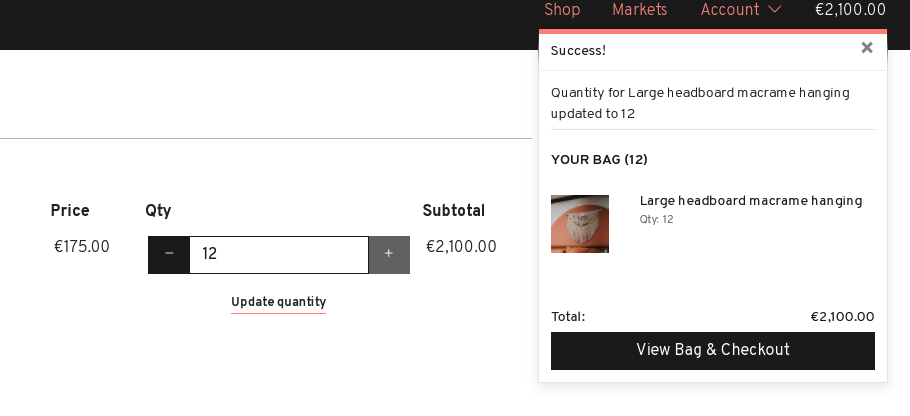
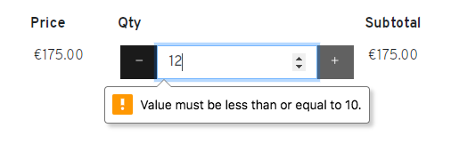

# Knot Art - Testing documentation
---
*This file contains the Testing section of the [full README.md file for Knot Art](README.md).*

## Table of Contents
---
- [Testing](#testing)
  * [Code Validation](#code-validation)
  * [Test Cases - user stories](#test-cases---user-stories)
  * [Features Testing](#features-testing)
  * [Other Manual Testing](#other-manual-testing)
  * [Automated Testing](#automated-testing)
  * [Fixed Bugs](#fixed-bugs)
  * [Known Bugs](#known-bugs)
  * [Supported Screens and Browsers](#supported-screens-and-browsers)

  ## Testing
---
### Code Validation
#### CSS
The [W3C CSS Validation Service](https://jigsaw.w3.org/css-validator/) was used to validate the project's custom CSS. [Each CSS file passes and the results can be viewed here](docs/code-validation/css-validation.pdf). Note: there are Warnings for the base.css file and these are explained below:
- `Same color for background-color and border-color`. I have used border colour same as background colour on some of the btns because either 1) on hover the background colour and border colour are different, so to keep the button size consistent between default and hover state and 2) in cases where two buttons are shown beside each other, one outlined and one solid colour. If the solid coloured button doesn't have a border then the buttons appear as different sizes, so keeping the border on the solid coloured button makes them consistent.
- `::-webkit-datetime-edit is a vendor extended pseudo-element`. I have used this vendor pseudo element to target the date and time 'placeholders' on the market form, in order to style them the same as other placeholder text. I understand that the vendor extensions are not programmed into the CSS validator and therefore they come up as a warning.

#### JavaScript
[JSHint](https://jshint.com/) was used to check the quality of the JavaScript code and check for errors. The errors raised were as follows:
- `Missing semicolon` errors were rectified
- `Functions declared within loops referencing an outer scoped variable may lead to confusing semantics.`. This error was raised in relation to a `for of` loop in the `handleQuantityInput()` function in script.js and in the `checkStartAndEndTimes()` function in form_validation.js in the markets app. I amended these loops to `forEach`.

There are no errors remaining and [the final results of the JSHint checks on each file can be viewed here](docs/code-validation/javascript-validation.pdf).

#### Python
[PEP8 online checker](http://pep8online.com/) was used to validate the Python code for all files created by me. Django standard files have not been validated or amended in relation to line length errors since these are standard Django files. The results of the validation for each app and for the overall project files are linked below:
- [cart app PEP8 validation results](docs/code-validation/cart-app-python-validation.pdf)
- [checkout app PEP8 validation results](docs/code-validation/checkout-app-python-validation.pdf)
- [home app PEP8 validation results](docs/code-validation/home-app-python-validation.pdf)
- [markets app PEP8 validation results](docs/code-validation/markets-app-python-validation.pdf)
- [products app PEP8 validation results](docs/code-validation/products-app-python-validation.pdf)
- [profiles app PEP8 validation results](docs/code-validation/profiles-app-python-validation.pdf)
- [project level file PEP8 validation results](docs/code-validation/project-level-files-python-validation.pdf)

### Test Cases - user stories

### Features Testing

### Other Manual Testing

### Automated Testing

### Fixed Bugs
- **Issue: On cart page can add more than max allowed**

On the Cart the Qty buttons don't allow a user to increase quantity higher than 10 (max quantity allowed), but a user can manually type in a higher number, and after pressing Update quantity, the bag updates as normal as shown above.
> Solution: The issue was because the Update quantity is handled by jQuery using the `.submit()` method, and not by a form submit button (a form submit button would trigger the HTML form validation). The `.submit()` method called on the form does not trigger constraint validation. However the `.requestSubmit()` method *does* trigger constraint validation, so the function was updated to use `.requestSubmit()` instead of `.submit()`, as shown below. I found this solution through a post on the Code Institute Slack dev-tips-library channel by [Igor Basuga](https://github.com/bravoalpha79) where he described investigating a similar bug and the solution. I had read the post and remembered it, I knew this bug was because of the form submit being prevented but I would likely have come up with a much more complicated solution had I not remembered this post!
```javascript
function submitQuantityUpdateForm() {
    if($('.update-link')) {
        $('.update-link').click(function() {
            $(this).prev('.update-form')[0].requestSubmit();
        });
    }
}

```
After this change the validation is triggered and an error is shown if the quantity is outside the range:




### Known Bugs

### Supported Screens and Browsers