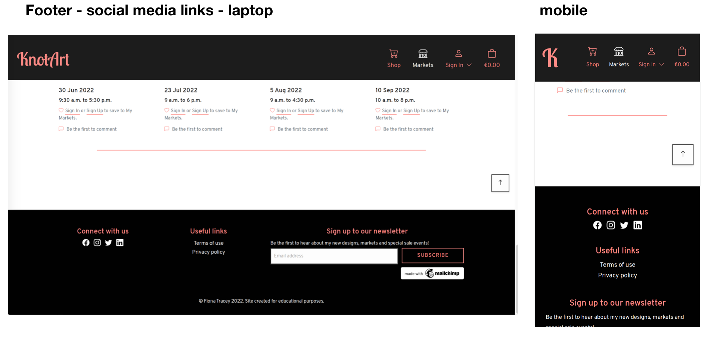
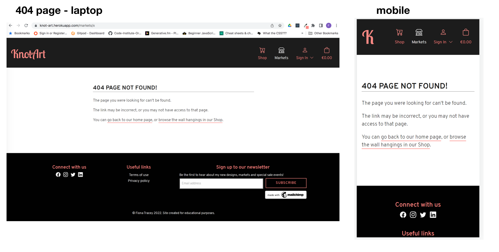
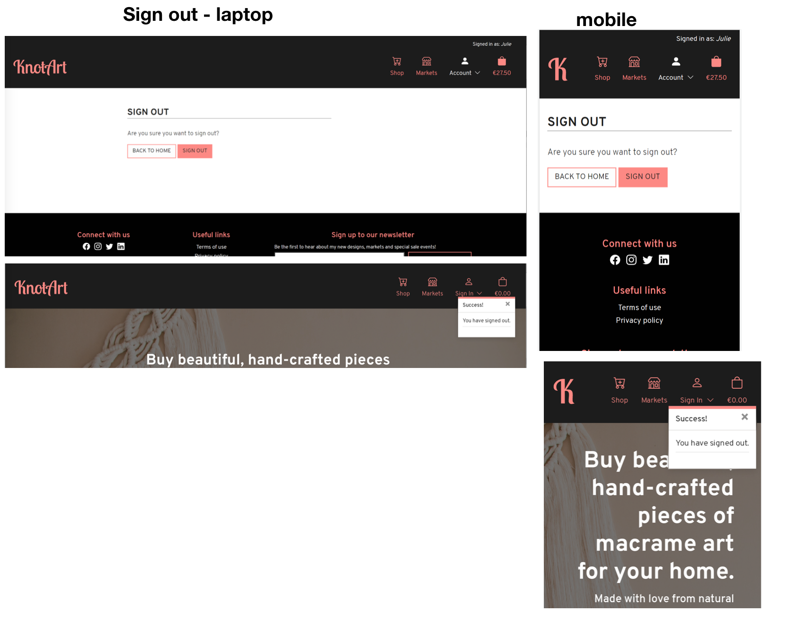
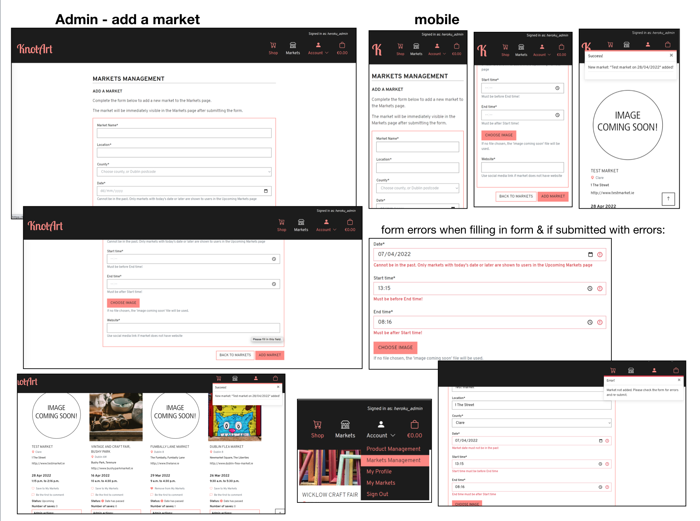

# Knot Art - Testing documentation
---
*This file contains the Testing section of the [full README.md file for Knot Art](README.md).*

*Note: any email addresses shown in the testing images in this document are temporary and do not belong to real users, similarly with any delivery details.*

## Table of Contents
---
- [Testing](#testing)
  * [Code Validation](#code-validation)
  * [Test Cases - user stories](#test-cases---user-stories)
  * [Features Testing](#features-testing)
  * [Other Manual Testing](#other-manual-testing)
  * [Automated Testing](#automated-testing)
  * [Fixed Bugs](#fixed-bugs)
  * [Known Bugs](#known-bugs)
  * [Supported Screens and Browsers](#supported-screens-and-browsers)

  ## Testing
---
### Code Validation
#### HTML
The [W3C Markup Validation Service](https://validator.w3.org/) was used to validate the HTML on every page of the project. Validation was done using url for pages that did not need a sign in, and by copying the results of 'View Page Source' into the Direct Input field of the validator for pages that require a log in.

The errors that were raised and fixes done are as follows:
- On pages that used the Custom Clearable File Input for the image upload, there was a `duplicate attribute` error, there were two id attributes on the `input` element. This arose because an id was added to the` input` element in `custom_clearable_file_input.html`, but Django auto adds an id to each input when generating the model form. I removed the id from the `custom_clearable_file_input.html`, and since this id was being used in the `fileInputShowFileName` function (to listen for a change and show the file name of the new image), updated the id in this function also.


- On pages using the breadcrumb menu, there was an error due to placement of a `span` between two `li` elements. The `span` was here to replace the Bootstrap default divider between breadcrumb items, removed this and over-rode the divider in the css instead.


- On the delete comment modal, there was an error in relation to missing a closing `p` tag. While the closing `p` tag was not missing in the typed code, the error was arising because of the `|linebreaks` Django filter, that automatically creates `p` tags. Remove the `p` tags surrounding this (as they generate by the filter) to clear this error.


There is one warning remaining due to using a h1 element in a section but not a direct child of a section. There are divs between the section and the h1, for layout and spacing and for consistency across pages. 

The [results of validating each HTML page can be viewed here](docs/code-validation/html-validation.pdf).

#### CSS
The [W3C CSS Validation Service](https://jigsaw.w3.org/css-validator/) was used to validate the project's custom CSS. [Each CSS file passes and the results can be viewed here](docs/code-validation/css-validation.pdf). Note: there are Warnings for the base.css file and these are explained below:
- `Same color for background-color and border-color`. I have used border colour same as background colour on some of the btns because either 1) on hover the background colour and border colour are different, so to keep the button size consistent between default and hover state and 2) in cases where two buttons are shown beside each other, one outlined and one solid colour. If the solid coloured button doesn't have a border then the buttons appear as different sizes, so keeping the border on the solid coloured button makes them consistent.
- `::-webkit-datetime-edit is a vendor extended pseudo-element`. I have used this vendor pseudo element to target the date and time 'placeholders' on the market form, in order to style them the same as other placeholder text. I understand that the vendor extensions are not programmed into the CSS validator and therefore they come up as a warning.

#### JavaScript
[JSHint](https://jshint.com/) was used to check the quality of the JavaScript code and check for errors. The errors raised were as follows:
- `Missing semicolon` errors were rectified
- `Functions declared within loops referencing an outer scoped variable may lead to confusing semantics.`. This error was raised in relation to a `for of` loop in the `handleQuantityInput()` function in script.js and in the `checkStartAndEndTimes()` function in form_validation.js in the markets app. I amended these loops to `forEach`.

There are no errors remaining and [the final results of the JSHint checks on each file can be viewed here](docs/code-validation/javascript-validation.pdf).

#### Python
[PEP8 online checker](http://pep8online.com/) was used to validate the Python code for all files created by me. Django standard files have not been validated or amended in relation to line length errors since these are standard Django files. The results of the validation for each app and for the overall project files are linked below:
- [cart app PEP8 validation results](docs/code-validation/cart-app-python-validation.pdf)
- [checkout app PEP8 validation results](docs/code-validation/checkout-app-python-validation.pdf)
- [home app PEP8 validation results](docs/code-validation/home-app-python-validation.pdf)
- [markets app PEP8 validation results](docs/code-validation/markets-app-python-validation.pdf)
- [products app PEP8 validation results](docs/code-validation/products-app-python-validation.pdf)
- [profiles app PEP8 validation results](docs/code-validation/profiles-app-python-validation.pdf)
- [project level file PEP8 validation results](docs/code-validation/project-level-files-python-validation.pdf)

### Test Cases - user stories
*Note:* testing of the user stories was carried out while each user story/feature was developed, to ensure acceptance criteria were met before the issue was closed. The below documents the user story testing that was completed at the end of the project, again grouped under the same headings as outlined in the User Stories section. 

#### General, site purpose, navigation:
- [#1](https://github.com/Fiona-T/knot-art/issues/1) As a visiting user, I can easily find out what the purpose of the website is and learn more about the site owner and the products being sold, so that I  can decide to stay and browse or not
    *  Acceptance Criteria 1:  The first thing the user should see on entering the website is an image which sets the tone of the website and a tagline explaining the purpose of the website
    *  Acceptance Criteria 2: There should be a learn more button, which will link to the information about the maker and the website
    *  Acceptance Criteria 3: There should be a 'Shop now' button which will link to the shop, the primary purpose of the website
    * Acceptance Criteria 4: Below the main image, there should be a section explaining to users what the website is for, and introducing the website owner who makes the products
  >**Result:** Pass, the above acceptance criteria are met, as shown below:


- [#2](https://github.com/Fiona-T/knot-art/issues/2) As a site user, I can navigate the site so that I can find the page I want to go to
    *  Acceptance Criteria 1:  There should be a site header which is at the top of every page on the website
    *  Acceptance Criteria 2: The logo (website name) should be prominent in the header and it should link back to the home page
    *  Acceptance Criteria 3: The header should contain navigation links to the Shop, Markets and Account, and Cart pages.
    >**Result:** Pass, above acceptance criteria are met, as shown below in the screenprint for the previous user story. Logo downsizes to a 'K' on smaller screens to allow more space for menu items. Logo links to home page. Header is present on all pages and fixed to top.

- [#3](https://github.com/Fiona-T/knot-art/issues/3) As a site user, I can find the Knot Art social media accounts, so that I can follow them on social media to keep up to date
    *  Acceptance Criteria 1:  The links to the social media accounts should be in the footer on each page, represented by their icons
    *  Acceptance Criteria 2: The links are external, so open in a new window
    *  Acceptance Criteria 3: The links are for the Facebook business page, Twitter, Instagram and LinkedIn
    >**Result:** Pass, acceptance criteria met. Footer present on all pages with social media links. Links open in new window.
    

- [#4](https://github.com/Fiona-T/knot-art/issues/4) As a site user, I can sign up to the newsletter, so that I can stay informed  and stay engaged with the shop
    *  Acceptance Criteria 1:  The footer on each page should contain a form to sign up for the newsletter
    *  Acceptance Criteria 2: The form consists of one field for email address, and a button to sign up
    *  Acceptance Criteria 3:  After submitting the form, the email address submitted is added to the subscribers list in mailchimp
    >**Result:** Pass, the above acceptance criteria are met, as shown below:
    

- [#5](https://github.com/Fiona-T/knot-art/issues/5) As a site user, I can see a 'Page not found' page with consistent branding to the rest of the site, when I try to access a page in error, so that I can find my way back to the website and know I have not left the website
    *  Acceptance Criteria 1:  the 404 page not found that is displayed to the user is consistent with the branding on the rest of the website
    *  Acceptance Criteria 2: the page contains the header and footer as per the rest of the website
    *  Acceptance Criteria 3: the page contains a short note to the user explaining the page wasn't found, along with links for them to get back to the main website
    >**Result:** Pass, the above acceptance criteria are met, as shown below:
    

- [#6](https://github.com/Fiona-T/knot-art/issues/6) As a site user, I can find the terms of use and privacy policy so that I can read these documents and have trust in the site
    *  Acceptance Criteria 1:  The links to the Terms of Use and Privacy Policy are present in the footer on each page
    *  Acceptance Criteria 2:  The links are internal so open in same window
    *  Acceptance Criteria 3: Each link contains the correct policy
    >**Result:** Pass, the above acceptance criteria are met, as shown below. The links are present in the footer as shown in previous user stories. Both links open internally as modals. There are buttons at both top and bottom to close the modal. Both documents also provide a link to read the relevant policy in a new window. 
    

- [#52](https://github.com/Fiona-T/knot-art/issues/52) As a user I can click on a back to top button so that I can get back to the top of the page without having to scroll
    *  Acceptance Criteria 1:  On the Shop page where products are listed, there is a back to top button fixed to bottom of the screen
    *  Acceptance Criteria 2: Clicking the button brings the user back to the top of the page
    >**Result:** Pass, the above acceptance criteria are met, as shown below. The button is present on the Shop page, and also on the Markets/My Markets page, and for mobile on the Cart page since this can be a long page on mobile. (the user story was added specifically for the Shop page as that had been developed at that stage - this feature was automatically included with the other pages when they were created, when relevant)
    

- [#53](https://github.com/Fiona-T/knot-art/issues/53) As a user I can see a message confirming my actions (e.g. adding item to bag) so that I know my changes were received
    *  Acceptance Criteria 1:  when a user performs actions that interact with the site, a message is displayed confirming the action was successful, or if there were errors
    *  Acceptance Criteria 2: E.g. in the search box on Shop page, if no search items entered it generates an error message
    *  Acceptance Criteria 3: Or for adding, removing, adjusting quantity of items in the shopping cart
    >**Result:** Pass, the above acceptance criteria are met, as shown below. Messages are displayed for all user actions, either success/error/info. If there are items in the bag and the user is on the cart page or adding a product then the bag summary is shown in the message. If not, then just the message (as bag summary not relevant for other actions). Samples of messages are shown below.
    

- [#62](https://github.com/Fiona-T/knot-art/issues/62) As a user I can see a page styled the same way as the website when I get a server error or access denied so that I can find my way back to the correct page on the website
    *  Acceptance Criteria 1:  the pages displayed to the user for a 403 (permission denied), and 500 (server error) are consistent with the branding on the rest of the website
    *  Acceptance Criteria 2: the pages contain the header and footer as per the rest of the website
    *  Acceptance Criteria 3: the pages contains links for them to get back to the main website
    Note: 404 page already covered under previous user story: #5 
    >**Result:** Pass, the above acceptance criteria are met, as shown below
    

- [#91](https://github.com/Fiona-T/knot-art/issues/91) As a user I can quickly see which section of the website I am in from the main header so that I know which part of the website I am in and can navigate easily
    *  Acceptance Criteria 1:  The icon and text for each section of the website in the header change to a different colour when a user is on a page within that section of the website
    *  Acceptance Criteria 2: E.g. in markets, market details then Markets menu item will be a different colour
    *  Acceptance Criteria 3: For the superuser, when editing/adding a product or a market, the menu item will be Shop or Markets respectively since they are in this section of the website. (There are menu options from the Account dropdown for these pages, but they are not part of the user profile so the active menu item will be either Shop or Markets as appropriate)
    >**Result:** Pass, the above acceptance criteria are met, as shown in the screenprints for the previous user stories. The menu icon is highlighted in white when the user is on a page in that section of the website.

#### Shop - viewing products
- [#7](https://github.com/Fiona-T/knot-art/issues/7) As a site user, I can easily view all the products in the shop so that I can see all the available products immediately without having to sort or filter or take any action
    *  Acceptance Criteria 1:  When a user goes to the Shop page, they are presented with all products on the page
    *  Acceptance Criteria 2:  The user does not have to do anything, the default is that all products are listed
    * Acceptance Criteria 3:  Only products that are 'active' should be displayed
    * Acceptance Criteria 4:  The details shown for each product should be: name, image, price, category
    >**Result:** Pass, the above acceptance criteria are met, as shown below. Testing was done to ensure only active products are shown for regular users.
    

- [#8](https://github.com/Fiona-T/knot-art/issues/8) As a site user, I can view an individual item details so that I can see the full details including the description and decide whether to buy
    *  Acceptance Criteria 1:  A user can click on the product from the shop page and this brings them to a new page showing details of the product
    *  Acceptance Criteria 2: The details shown are: image, product name, product description, product category, price, a quantity selector and button to add to cart, and a button to go back to the shop page
    >**Result:** Pass, the above acceptance criteria are met, as shown below.
    

- [#9](https://github.com/Fiona-T/knot-art/issues/9) As a site user, I can select a specific category of product so that I can view just the items in that category to make it easier to make a decision
    *  Acceptance Criteria 1: in the shop page menu bar, there are menu options to choose a particular category
    *  Acceptance Criteria 2: when a particular category is chosen, only the products in that category are displayed
    *  Acceptance Criteria 3: the options are the categories currently set up by the store owner: Living Room, Bedroom, Minis. There should also be an ALL category (which the shop page defaults to, but will be needed for the user if they want to go back to seeing all products after selecting a category)
    >**Result:** Pass, the above acceptance criteria are met, as shown below. Categories are present, in a hamburger menu on mobile. Selected option is highlighted. Testing completed to ensure only products in selected category are shown. 
    

- [#10](https://github.com/Fiona-T/knot-art/issues/10) As a site user, I can sort the products in the shop so that I can find what I'm looking for more easily
    *  Acceptance Criteria 1: there is an option in the shop page menu bar to sort products
    *  Acceptance Criteria 2: the user can choose one of these options, and the products are sorted according to the choice 
    *  Acceptance Criteria 3: the choices should be: by product name (A to Z), by product name (Z to A), by price (low to high), by price (high to low) 
    >**Result:** Pass, the above acceptance criteria are met, as shown below. Sorting options are present and correct. Testing completed to ensure that each sorting option works. Sorting works on ALL products, or within individual categories. 
    

- [#11](https://github.com/Fiona-T/knot-art/issues/11) As a site user, I can search for a product in the shop so that I can find a particular item quickly
    *  Acceptance Criteria 1: There is a search box at the top of the shop page
    *  Acceptance Criteria 2: The user can enter a search term and the page will display products that match that search term
    *  Acceptance Criteria 3: The search should return if the word is in the product name, or product description
    >**Result:** Pass, the above acceptance criteria are met, as shown below. Search box present, results are returned or error if no search term entered. Testing completed to ensure that it functions correctly. 
    

- [#71](https://github.com/Fiona-T/knot-art/issues/71) As a user I can see the results for my filter option or search term so that I can quickly see how many products match my filter option/match my search term
    *  Acceptance Criteria 1:  when a user searches, the count of items found, and the search term are shown above the displayed products
    *  Acceptance Criteria 2: when a user selects a category of product from the sub menu of product categories, the count of items found, and the category option are shown above the displayed products
    >**Result:** Pass, the above acceptance criteria are met, as shown in the screenprints for the previous two user stories. 

#### Shop - adding to/updating the cart
- [#12](https://github.com/Fiona-T/knot-art/issues/12) As a site user, I can add an item to my cart so that I can buy it
    *  Acceptance Criteria 1:  from the product details page, a user can click on the Add to Bag button, to add an item to their bag
    *  Acceptance Criteria 2:  the subtotal underneath the Bag icon in the header should update to show the new total in the bag
    >**Result:** Pass, the above acceptance criteria are met, as shown below. Note: on smaller mobiles the text underneath the menu items in header is not shown, due to space, so the cart amount is not shown in the header, however the notification message still shows up, and the cart icon in the header changes from outlined to filled to show there is something in the cart. 
    

- [#13](https://github.com/Fiona-T/knot-art/issues/13) As a site user, I can select the quantity of an item before adding to my cart, so that I can add multiple of that item at once
    *  Acceptance Criteria 1:  from the product details page, a user can select the quantity to buy, before pressing the Add to Bag button
    *  Acceptance Criteria 2: the user can either use the + and - buttons beside the input box, or can type into the input box
    *  Acceptance Criteria 3: the user should not be able to input less than 1 or more than 10 of an item (since these are handmade and there is not huge stock available)
    * Acceptance Criteria 4: the updated subtotal appears in the cart when the quantity is changed
    >**Result:** Pass, the above acceptance criteria are met, as shown below: 
    
    In addition, there is a cap of 10 on the total for that item in the cart. E.g. already 3 of an item in the cart, adding another 10 from the product details page will bring the total for that item to 13, so this will generate an error as shown below. This is to keep the quantity of any one item within the range of 1-10, whether adding to cart initially, or adding the item again with a new quantity which will adjust total quantity in the cart:
    

- [#14](https://github.com/Fiona-T/knot-art/issues/14) As a site user I can see the total amount currently in my cart at all times, so that I can keep track of how much I'll be spending
    *  Acceptance Criteria 1:  the total that a user has currently added to their bag should be shown underneath the Bag icon in the header
    *  Acceptance Criteria 2: the total should remain constant across all pages
    *  Acceptance Criteria 3: total will be 0.00 if nothing in the bag
    >**Result:** Pass, the above acceptance criteria are met, as shown in the previous user stories. *Note: on smaller mobiles the text underneath the menu items in header is not shown, due to space, so the total in the cart is not shown on these sizes. However the cart icon in the header changes from outlined to filled to show there is something in the cart, and the user can click at any time onto the cart page to see the total. This is only on smaller mobile sizes below 375px due to space, and to allow the menu items be visible in the header for the user rather than collapsed to a hamburger icon.*

- [#15](https://github.com/Fiona-T/knot-art/issues/15) As a site user I can see the items in my cart at any time, so that I can check what I have already added to the cart
    *  Acceptance Criteria 1: a user can click on the Bag icon from the header and this brings them to a page showing the items that they have added to the bag
    *  Acceptance Criteria 2: there is a message if no items have been added, with button to return to shop
    *  Acceptance Criteria 3: the details shown for each item in the cart are: product details (image + product name), price, quantity and subtotal
    * Acceptance Criteria 4: underneath the listed items is a total, delivery charge amount and subtotal
    >**Result:** Pass, the above acceptance criteria are met, as shown below. On mobile the totals and checkout button are shown at the top, and with a back to top button as the layout of the cart is longer on mobile to allow a better layout for the user.
    

- [#16](https://github.com/Fiona-T/knot-art/issues/16) As a site user I can adjust the quantity of a particular item in the cart so that I can buy more or less of the item directly from the cart
    *  Acceptance Criteria 1:  when a user is viewing the bag page, there are quantity buttons shown for each item
    *  Acceptance Criteria 2: the user can use the quantity +/- to adjust the quantity and update the amount of the item in the cart, and the totals update accordingly
    *  Acceptance Criteria 3: the same quantity rules apply as before
    >**Result:** Pass, the above acceptance criteria are met, as shown below
    

- [#17](https://github.com/Fiona-T/knot-art/issues/17) As a site user, I can remove an item from my cart so that I do not have to buy it if I've changed my mind
    *  Acceptance Criteria 1:  when a user is on the bag page, there is a button/link beside each item in the cart to remove that item
    *  Acceptance Criteria 2: once they click the button/link, the item is removed and the totals update accordingly
    *  Acceptance Criteria 3: if this was the only item in the bag, then the page shows the message for when a bag is empty
    >**Result:** Pass, the above acceptance criteria are met, as shown below
    

#### Shop - payment and check out
- [#18](https://github.com/Fiona-T/knot-art/issues/18) As a site user, I can continue to the checkout process once I've decided on my purchase so that I can buy the items
    *  Acceptance Criteria 1:  the user can click on the Checkout button on the cart page, to bring them to the checkout page
    *  Acceptance Criteria 2:  on the checkout page there is a form for the user to fill in their personal info and delivery details
    *  Acceptance Criteria 3: there is also a section for payment details
    >**Result:** Pass, the above acceptance criteria are met, as shown below
    

- [#19](https://github.com/Fiona-T/knot-art/issues/19) As a site user, I can enter my delivery and payment details so that I can complete my purchase
    *  Acceptance Criteria 1:  on the checkout page, the user can enter their details into the form including payment details and then submit the details
    *  Acceptance Criteria 2: if the card details are invalid, an error message shows up underneath the payment section
    *  Acceptance Criteria 3: while the form is processing, the page shows that it is processing and the user cannot click anything on the page
    >**Result:** Pass, the above acceptance criteria are met, as shown below
    

- [#20](https://github.com/Fiona-T/knot-art/issues/20) As a site user, I can see the order summary while making payment so that I can still edit the details before payment if I made a mistake
    *  Acceptance Criteria 1:  when the user is on the checkout page, there is a summary of the cart items shown (as well as the checkout form/payment details)
    *  Acceptance Criteria 2: There is a button to go back and adjust the cart
    *  Acceptance Criteria 3: The summary shows each item, the image, quantity, subtotal, and then the total, delivery and grand total
    >**Result:** Pass, the above acceptance criteria are met, as shown in the user story for the checkout page above

- [#21](https://github.com/Fiona-T/knot-art/issues/21) As a registered user, I can save my delivery information when checking out so that it is saved to my profile for use with my next order
    *  Acceptance Criteria 1:  on the checkout page, if the user is signed in there is a tick box that the user can tick to save their delivery info to their profile
    *  Acceptance Criteria 2: if the user is not signed in, there is a note to tell them they can create an account to save this info/sign in to save info or use saved info
    *  Acceptance Criteria 3: when the box is ticked, the user's profile is updated with this default delivery info
    * Acceptance Criteria 4: if the user goes to make another purchase, when they go to the checkout page then the delivery info is prefilled
    >**Result:** Pass, the above acceptance criteria are met, as shown below
    

- [#22](https://github.com/Fiona-T/knot-art/issues/22) As a site user, I can see an order confirmation page so that I know that the order went through okay
    *  Acceptance Criteria 1:  after completing the checkout form and if there were no errors, the user is redirected to a success page confirming the order was successful
    *  Acceptance Criteria 2: the page shows all the order details - order number, date, the items in the order (quantity and item price), the delivery address, and the totals for the order (total, delivery, grand total)
    >**Result:** Pass, the above acceptance criteria are met, as shown below
    

- [#23](https://github.com/Fiona-T/knot-art/issues/23) As a site user, I can recieve an email confirmation of my order so that I have this confirmation for my records
    *  Acceptance Criteria 1:  after a user (either anonymous or logged in) successfully places an order, they receive an email confirming the details
    *  Acceptance Criteria 2: the email contains the Order number and shop name in the subject box
    *  Acceptance Criteria 3: the email body thanks the user for their order, and confirms the order date, totals and delivery info.
    >**Result:** Pass, the above acceptance criteria are met, as shown below. Note: there is a small bug where if the customer doesn't fill in the non-required address fields, there are blank lines for these in the email. This is noted in the [Known Bugs section](#known-bugs) for future fix.
    

- [#54](https://github.com/Fiona-T/knot-art/issues/54) As a user I can see a preview of my shopping cart when I make changes so that I can easily see the new cart
    *  Acceptance Criteria 1:  when a user takes any action relating to the shopping cart, a small preview of the shopping cart appears alongside the confirmation message
    *  Acceptance Criteria 2: the preview shows the number of items in the cart, and for each item the image, product name and quantity. The totals are shown at the bottom, along with a link to go to the cart page to checkout
    *  Acceptance Criteria 3: the preview is shown when the user adds to cart, adjusts quantity, or removes an item
    >**Result:** Pass, the above acceptance criteria are met, as shown in the screenprints for the confirmation messages user stories, and the other user stories for the cart shown previously. 

- [#57](https://github.com/Fiona-T/knot-art/issues/57) As a site owner I can ensure that an order is created once payment is made so that a customer does not make a payment, without an order being created in the database
    *  Acceptance Criteria 1:  the website uses Stripe's webhooks to handle the payment
    *  Acceptance Criteria 2:  if the browser window closes after payment was completed but before the order form was actually submitted, an order is still created in the database
    *  Acceptance Criteria 3: if there was an error with the payment intent, the page reloads for the user with the error shown and they can correct the payment details (and no order created)
    >**Result:** Pass, the above acceptance criteria are met, as shown below. An order is still created in the database if the payment goes through on Stripe, even if the browser window is closed. A failed payment reloads the page with the error message and the order is not created.
    

#### Markets - viewing markets
- [#24](https://github.com/Fiona-T/knot-art/issues/24) As a site user, I can easily view all the upcoming markets so that I can plan if I want to attend one of the markets
    *  Acceptance Criteria 1:  A user can go to the Markets page of the website and it displays a list of the upcoming markets
    *  Acceptance Criteria 2: Only markets that are not in the past are shown
    *  Acceptance Criteria 3: The details shown for each market are: name, location, date, times, website and an image
    >**Result:** Pass, the above acceptance criteria are met, as shown below. Testing was done to ensure only current (today or future) markets are shown for regular users in this view. *Note - a later user story was added to allow regular users see past markets, so they can read the comments, this is detailed below for user story [#90](https://github.com/Fiona-T/knot-art/issues/90) view past markets.*
    

- [#25](https://github.com/Fiona-T/knot-art/issues/25) As a site user, I can sort the markets list so that I can find what I'm looking for more easily
    *  Acceptance Criteria 1:  there is an option in the markets page menu bar to sort the markets
    *  Acceptance Criteria 2: the user can choose one of these options, and the markets are sorted according to the choice
    *  Acceptance Criteria 3: the choices should be: by name (A to Z), by name (Z to A), by date (ascending), by date (descending)
    >**Result:** Pass, the above acceptance criteria are met, as shown below. Sorting options are present and correct. Testing was completed to ensure that each sorting option works. Sorting works on all markets, or when filtered by counties.
    

- [#26](https://github.com/Fiona-T/knot-art/issues/26) As a registered user, I can save a market that I want to go to, so that I don't forget about it as it will be in my profile
    *  Acceptance Criteria 1:  A user who is logged in can see a button on each market card in the markets page
    *  Acceptance Criteria 2: The button allows them to save the market to their profile
    *  Acceptance Criteria 3: After clicking the button to save the market, the user can see a success message
    >**Result:** Pass, the above acceptance criteria are met, as shown below. 
    

- [#27](https://github.com/Fiona-T/knot-art/issues/27) As a registered user, I can see if I have saved a market already when viewing the markets list, so that I know if it's already saved in my profile or not
    *  Acceptance Criteria 1:  when a user is logged in and is on the markets page, each market card has a button, the text on the button is different depending on whether the user has saved the market or not
    *  Acceptance Criteria 2: if the market is not saved, the button says 'save market to profile' (or similar)
    *  Acceptance Criteria 3: if the market is saved, then the button text is 'remove market from profile' (or similar)
    >**Result:** Pass, the above acceptance criteria are met, as shown below in the screenprint for the previous user story, after the market was saved.

- [#28](https://github.com/Fiona-T/knot-art/issues/28) As a registered user, I can remove a previously saved market from my profile so that it is no longer in my profile if I don't want to go to it
    *  Acceptance Criteria 1:  when a user is logged in and on the Markets page, the markets they have saved have a button called 'remove market from profile' (or similar)
    *  Acceptance Criteria 2: the user can click on this button to remove the market from their saved markets
    *  Acceptance Criteria 3: a success message is displayed and the market in the Markets page now has a button for 'save market'
    >**Result:** Pass, the above acceptance criteria are met, as shown below. 
    

- [#60](https://github.com/Fiona-T/knot-art/issues/60) As a user I can select a county to filter the markets by so that I can easily see just the markets in that particular county
    *  Acceptance Criteria 1:  in the markets page, the sub header has a dropdown of counties that the user can select from
    *  Acceptance Criteria 2: the default is all counties
    *  Acceptance Criteria 3: when a particular county is selected, only the markets in that county are shown
    * Acceptance Criteria 4: the options are the counties in Ireland plus the areas in Dublin (Dublin 1, 2 etc.)
    * Acceptance criteria tweaked during development for better UX: restricted dropdown list to the counties that currently exist in the markets queryset returned from db, so that the user does not select a county that returns no results. Also currently selected county is shown in the dropdown list, or All if none. 
    >**Result:** Pass, the above acceptance criteria are met, as shown below. Testing completed to ensure results returned are correct. 
    

- [#80](https://github.com/Fiona-T/knot-art/issues/80) As a user I can see how many comments are on a market so that I can decide if I want to read them or not
    *  Acceptance Criteria 1:  on the markets page, each market shows the number of comments
    *  Acceptance Criteria 2: or if there are no comments, it shows 'Be the first to comment' or similar
    *  Acceptance Criteria 3: clicking on the number of comments will bring the user to view a market details page
    >**Result:** Pass, the above acceptance criteria are met, as shown below, and clicking on the comments opens the market details page.
    

- [#88](https://github.com/Fiona-T/knot-art/issues/88) As a website owner I can see how many users have saved a market so that I can get an idea of how popular it might be
    *  Acceptance Criteria 1:  When a superuser is logged in, on the markets page each market card shows the number of saves for that market
    *  Acceptance Criteria 2:  When a superuser is logged in, on the market_details page the market details includes the number of saves for that market
    *  Acceptance Criteria 2: This information is not visible to regular users
    >**Result:** Pass, the above acceptance criteria are met, as shown below, this view is when a superuser is logged in.
    

- [#90](https://github.com/Fiona-T/knot-art/issues/90) As a user I can view markets that are in the past so that I can read the comments on them to get a feel for them if the market runs again
    *  Acceptance Criteria 1:  On the markets page, there is an option for the user to click on to View Previous Markets
    *  Acceptance Criteria 2:  After clicking this, the markets displayed on the page are those that are in the past
    *  Acceptance Criteria 3: There is a button to then go back to viewing the Upcoming markets
    *  Acceptance Criteria 4: The intro text on the page changes accordingly, so that user is aware they are viewing past markets
    *  Acceptance Criteria 5: This view is just for regular users, admin users can view all markets (past and present) in their default view
    >**Result:** Pass, the above acceptance criteria are met, as shown below, and testing was completed to ensure the markets shown in each view are correct. User can click into any market to see the details and read the comments.
    

#### Markets - comments
- [#78](https://github.com/Fiona-T/knot-art/issues/78) As a registered user I can add a comment to a market so that I can share my views on a market with other users
    *  Acceptance Criteria 1:  When a sign in user is on the market details page, there is a text box for them to leave a comment, and a button to submit the comment
    *  Acceptance Criteria 2: If the user is not logged in, then there is a note advising to sign in/register in order to comment
    *  Acceptance Criteria 3: After submitting the comment the page updates and the comment is now visible on the market
    >**Result:** Pass, the above acceptance criteria are met, as shown below.
    

- [#81](https://github.com/Fiona-T/knot-art/issues/81) As a user I can read all the comments on a market so that I can see other users' opinions/questions on that market
    *  Acceptance Criteria 1:  on the markets page, there is a section on each market showing the number of comments 
    *  Acceptance Criteria 2: clicking on this brings the user to a market details page where they can then see all the comments displayed
    >**Result:** Pass, the above acceptance criteria are met, as shown in the screenprints for the previous user stories number 78 and 80.

- [#84](https://github.com/Fiona-T/knot-art/issues/84) As a registered user I can edit a comment that I posted on a market so that I can correct the comment if needed
    *  Acceptance Criteria 1:  When a user is logged in and viewing comments on a market, any comment that the user has posted has a link to edit it
    *  Acceptance Criteria 2: After clicking the link to edit, they are presented with the comment form (comment field) with the original comment populated and a button to confirm updates
    *  Acceptance Criteria 3: After submitting the changes, the edited comment appears on the page and there is a success message confirming the comment was updated
    * Acceptance Criteria 4: The user cannot edit a comment that was posted by a different user
    >**Result:** Pass, the above acceptance criteria are met, as shown below. Trying to access the edit comment url of another user brings up the 403 permission denied page.
    

- [#85](https://github.com/Fiona-T/knot-art/issues/85) As a registered user I can delete a comment that I posted on a market so that I can remove it if I don't want others to see the comment or I posted it in error
    *  Acceptance Criteria 1:  When a user is logged in and viewing the comments on a market, any comment that the user posted has a link to delete it
    *  Acceptance Criteria 2: After clicking on the link they see a modal asking them to confirm deletion
    *  Acceptance Criteria 3: After confirming the deletion, the comment is no longer displayed on the page and there is a success message confirming the comment was deleted
    * Acceptance Criteria 4: The user cannot delete a comment that was added by someone else
    >**Result:** Pass, the above acceptance criteria are met, as shown below. The view is post only, so cannot access by url as a get request, and will raise permission denied if current user is not comment author. 
    

#### User account set up, sign in and out
- [#29](https://github.com/Fiona-T/knot-art/issues/29) As a site user, I can sign up for an account, so that I can enjoy the benefits of having an account e.g. saving delivery info
    *  Acceptance Criteria 1:  the sign up page opens after the user clicks on link from header to sign up
    *  Acceptance Criteria 2:  the sign up form contains the fields for the user to register - username, email address, email address confirmation, password, confirm password and Submit button
    *  Acceptance Criteria 3: the form doesn't submit unless the required fields are completed or if there are errors in the inputs
    * Acceptance Criteria 4: after the form is submitted successfully, the email verification page is displayed, see #30 
    >**Result:** Pass, the above acceptance criteria are met, as shown below. Form validation (built in html validation/allauth/django) works. Confirmation page to verify email address is displayed as shown.
    

- [#30](https://github.com/Fiona-T/knot-art/issues/30) As a site user, I want to receive an email confirmation when I register, so that I know my account registration was successful and secure
    *  Acceptance Criteria 1:  After filling in the sign up form (see #29 ) the user is redirected to a page confirming an email was sent for them to verify their email address
    *  Acceptance Criteria 2:  There should be an email received by that email address, providing a link to be used to verify the email address
    *  Acceptance Criteria 3: The link brings the user to a new page where they can press a button to confirm the email address
    * Acceptance Criteria 4: after pressing the button, the user is brought to the sign in page to sign in
    >**Result:** Pass, the above acceptance criteria are met, as shown below. Confirmation page to verify email address is displayed as shown in previous user story. Email is sent to user with link to verify their address, redirects to sign in page afterwards and new user can sign in.
    

- [#31](https://github.com/Fiona-T/knot-art/issues/31) As a registered user, I can sign into my account so that I can access my profile
    *  Acceptance Criteria 1:  the sign in page opens after the user clicks on link from header to sign in
    *  Acceptance Criteria 2:  the sign up form contains the fields for the user to sign in - username or email address, and password - and Sign in button
    *  Acceptance Criteria 3: After submitting the form, the user is redirected to the home page
    >**Result:** Pass, the above acceptance criteria are met, as shown below:
    

- [#32](https://github.com/Fiona-T/knot-art/issues/32) As a registered user, I can sign out of my account when finished, so that I know I am signed out securely
    *  Acceptance Criteria 1:  When a user is signed in, the Sign Out link is present in the header from underneath the Account section
    *  Acceptance Criteria 2:   After clicking the Sign Out link, the Sign Out page opens
    *  Acceptance Criteria 3: Sign Out page has text asking user to confirm they want to sign out, and a button
    * Acceptance Criteria 4: After signing out, the user is redirected to the home page
    >**Result:** Pass, the above acceptance criteria are met, as shown below:
    

- [#33](https://github.com/Fiona-T/knot-art/issues/33) As a registered user, I can easily see if I am signed into my account or not, so that I know straight away if I need to sign in
    *  Acceptance Criteria 1:  When a user is not signed in, there is a menu item in the main page navigation called Sign In. This menu item changes to 'Account' when the user is signed in (and the menu dropdown items change accordingly)
    *  Acceptance Criteria 2: When the user is signed in, the header contains a note that they are "signed in as username"
    *  Acceptance Criteria 3: When signed in, the My Profile page shows the user's name
    * Acceptance Criteria 4: On the checkout page, if the user is not signed in there is a note telling them they can sign in to use their saved default delivery info. (If they are signed in, then their default delivery info if any is populated on the delivery details, as per user story [#21](https://github.com/Fiona-T/knot-art/issues/21) saving delivery information)
    * Acceptance Criteria 5: When viewing the Markets page, if the user is not logged in then they see a note saying Sign in to save the market, if they are signed in then they see a button to save the market or remove it
    >**Result:** Pass, the above acceptance criteria are met, as shown below:
    

#### User profile 
- [#34](https://github.com/Fiona-T/knot-art/issues/34) As a registered user, I can update my default delivery information in my profile, so that the updated details are recorded for future orders
    *  Acceptance Criteria 1:  a user who is logged in can go to their profile page and there is a form to update their delivery info
    *  Acceptance Criteria 2: the form is pre-filled with any already saved delivery info
    *  Acceptance Criteria 3: the fields on the form are: phone number, address 1 + 2, town/city, postcode, county and country and a button to update the information
    >**Result:** Pass, the above acceptance criteria are met, as shown below and testing completed to ensure any updates are saved.
    

- [#35](https://github.com/Fiona-T/knot-art/issues/35) As a registered user, I can see my previous orders in my profile, so that I can see all the orders I made and can find details of a previous order
    *  Acceptance Criteria 1:  when a user is signed in and goes to their profile page, they can see their order history
    *  Acceptance Criteria 2: if there are no previous orders, there is a note stating this and a link to the shop
    *  Acceptance Criteria 3: if there are previous orders, these are listed with the newest first and show the order number, date, items and quantity, and final total
    >**Result:** Pass, the above acceptance criteria are met, as shown below
    

- [#36](https://github.com/Fiona-T/knot-art/issues/36) As a registered user, I can see all the markets I saved and view their details so that I have access to this information
    *  Acceptance Criteria 1:  when a user is logged in, there is a menu option under Account for My Markets
    *  Acceptance Criteria 2: when they go to this page, if they have saved markets then they are displayed here, in the same format as the main Markets page, with the same details
    *  Acceptance Criteria 3: if they do not have any saved markets then the page just displays a note confirming this
    >**Result:** Pass, the above acceptance criteria are met, as shown below
    

- [#37](https://github.com/Fiona-T/knot-art/issues/37) As a registered user, I can remove a previously saved market from my profile so that it is no longer in my profile if I don't want to go to it
    *  Acceptance Criteria 1:  when a user is logged in and on the My Markets page in the Account section, each market shown there has a button for 'remove from profile' (or similar wording)
    *  Acceptance Criteria 2: clicking the button removes the market from their profile and they see a success message
    *  Acceptance Criteria 3: the market no longer appears in their My Markets page
    Note - linked to #28 which is to remove the market via the main Markets page
    >**Result:** Pass, the above acceptance criteria are met, as shown in previous screenprints

- [#58](https://github.com/Fiona-T/knot-art/issues/58) As a registered user I can view details of a previous order so that I can check what was ordered and where it was delivered to
    *  Acceptance Criteria 1:  a logged in user who has previous orders can go to their order history and click on an order to view the full details
    *  Acceptance Criteria 2: the order number links to the details page
    *  Acceptance Criteria 3: the details displayed are the same as those displayed in the checkout success page.
    >**Result:** Pass, the above acceptance criteria are met, as shown below
    

- [#61](https://github.com/Fiona-T/knot-art/issues/61) As a registered user I can sort the markets list in My Markets page so that I can find the market I'm looking for more easily
    *  Acceptance Criteria 1:  there is an option in the My Markets page menu bar to sort the markets
    *  Acceptance Criteria 2:  the user can choose one of these options, and the markets are sorted according to the choice
    *  Acceptance Criteria 3:  the choices should be: by name (A to Z), by name (Z to A), by date (ascending), by date (descending)
    >**Result:** Pass, the above acceptance criteria are met, as shown below. Sorting options are present and correct. Testing was completed to ensure that each sorting option works. Sorting works on all markets, or when filtered by counties, within my markets page.
    

- [#74](https://github.com/Fiona-T/knot-art/issues/74) As a registered user I can filter my saved markets by county so that I can easily see just my saved markets in that particular county
    *  Acceptance Criteria 1:  in the my_markets page, if the user has saved markets, the sub header has a dropdown of counties that the user can select from
    *  Acceptance Criteria 2: the default is all counties and the counties available to select from are the counties that exist for the saved markets only (so no filter returns 0 results)
    *  Acceptance Criteria 3: when a particular county is selected, only the markets in that county are shown
    >**Result:** Pass, the above acceptance criteria are met, as shown below. Testing completed to ensure results returned are correct.
    

- [#77](https://github.com/Fiona-T/knot-art/issues/77) As a registered user I can easily navigate within the My Account pages so that I understand what pages are available and can get to them easily and I know what page I am on
    *  Acceptance Criteria 1:  when a logged in user is on the My Account pages (My Profile and My Markets) there is a breadcrumb menu at the top showing them where they are, e.g. My Account - > My Profile
    *  Acceptance Criteria 2:  On the My Profile page there is a link to view their saved markets
    *  Acceptance Criteria 3:  On the My Markets page there is a link to view their Profile
    >**Result:** Pass, the above acceptance criteria are met, as shown below
    

#### Admin for Shop page
- [#38](https://github.com/Fiona-T/knot-art/issues/38) As the website owner, I can view all the products in the shop, even if they are not active, so that I can see an overview of all products, and so that I can edit inactive products
    *  Acceptance Criteria 1: When a superuser is logged in, they can see all items in the shop, even those that are not active
    *  Acceptance Criteria 2: The card for each product also displays the active status (this is not shown on the normal view for regular or anonymous users) 
    >**Result:** Pass, the above acceptance criteria are met, as shown below
    

- [#39](https://github.com/Fiona-T/knot-art/issues/39) As the website owner, I can add a new product to the shop, so that I can sell the product to customers
    *  Acceptance Criteria 1:  when the admin user is logged in, they have an option under the Account menu for Product Management
    *  Acceptance Criteria 2: when they go to this page, there is a form to Add a Product
    *  Acceptance Criteria 3: the fields on the form are: category dropdown, sku, name, description, price, image and check boxes for active product and new product
    * Acceptance Criteria 4: the product name must not be the same as an existing product name
    * Acceptance Criteria 5: the active and new checkboxes default to checked and the image field is optional (as the no-image file will show up for the product if there is no image attached)
    * Acceptance Criteria 6: after adding the product (and assuming the active flag is ticked), the product shows up in the shop page for users to buy
    >**Result:** Pass, the above acceptance criteria are met, as shown below. Note - sku was removed from the form after user story [#66](https://github.com/Fiona-T/knot-art/issues/66) - generate sku - was added. Form validation is in place, can't submit form without required fields being completed. Error shown in same product name as existing product.
    

- [#40](https://github.com/Fiona-T/knot-art/issues/40) As the website owner, I can add a edit the details of a product in the shop, so that I can change the price, description etc. and customers will see the updated information
    *  Acceptance Criteria 1:  When admin user is signed in, they can see an Edit link/button on the products in the shop on both the main shop page and in the product details page
    *  Acceptance Criteria 2: Clicking the link brings them to the edit product page which displays a form with the existing details pre-populated (same form as the add product form in #39 )
    *  Acceptance Criteria 3: The user can change the details as needed and submit the form
    * Acceptance Criteria 4: Once submitted successfully the page redirects to the product details page for that product with the updated details
    >**Result:** Pass, the above acceptance criteria are met, as shown below. Edit links are in shop page and product details page as shown previously. Same validation in place on this form as add product.
    

- [#41](https://github.com/Fiona-T/knot-art/issues/41) As the website owner, I can turn on or off the active flag on a product, so that I can add or remove it from appearing in the shop for customers when it is in/out of stock
    *  Acceptance Criteria 1:  when the admin user is logged in, they can see a tick box beside Active product for all products in the shop and in the product details page
    *  Acceptance Criteria 2: they can tick the box to make it Active (and product appears in shop for regular users)
    *  Acceptance Criteria 3:  they can untick the box to make it Not Active (and product does not appear in the shop for regular, non-admin, users)
    >**Result:** Pass, the above acceptance criteria are met, as shown below
    

- [#42](https://github.com/Fiona-T/knot-art/issues/42) As the website owner, I can delete a product, so that it will not appear in the shop if it was added in error
    *  Acceptance Criteria 1:  When admin user is signed in, they can see a Delete link/button on the products in the shop on both the main shop page and in the product details page
    *  Acceptance Criteria 2: Clicking the link brings up a confirmation box where they can either Cancel to go back, or press Confirm to confirm the deletion. The confirmation box shows the summary details of the product they are about to delete.
    *  Acceptance Criteria 3: Once deleted, the product no longer appears in the shop
    >**Result:** Pass, the above acceptance criteria are met, as shown below
    

- [#43](https://github.com/Fiona-T/knot-art/issues/43) As a website owner I can access the Django admin site for the categories so that I can add, edit or delete categories from here and new products for these categories can be added to the shop
    *  Acceptance Criteria 1:  The admin user can log into the Django admin site and can add a category from there (standard Django functionality for admin site). 
    *  Acceptance Criteria 2: The admin user can also edit/delete categories from there
    *Note: for a future feature, this functionality could be added to the website under the Product Management dropdown*
    >**Result:** Pass, the above acceptance criteria are met, as shown below
    

- [#51](https://github.com/Fiona-T/knot-art/issues/51) As a site owner I can access the Django admin site for the products so that I can view, edit, delete products from here as well as from the website
    *  Acceptance Criteria 1:  The admin user can go to the django admin site and view the products and categories tables inside the products app.
    *  Acceptance Criteria 2:  For the categories table, the category name and friendly name are displayed in the list view
    *  Acceptance Criteria 3: For the products table, the list view shows product name, sku, category, price, if new, if active. 
    * Acceptance Criteria 4: In the list view for products, the user can filter by category, by the active flag and by the new flag
    * Acceptance Criteria 5: the user can add, edit and delete products and categories from this view (default Django functionality)
    * Acceptance Criteria 6: the user can amend the is_active flag from list view, and can search by product name
    >**Result:** Pass, the above acceptance criteria are met, as shown below (see previous for categories list view). Products can also be added, edited and deleted from the django admin site.
    

- [#56](https://github.com/Fiona-T/knot-art/issues/56) As a website owner I can see orders in the admin site so that I can access the order details and fulfil the orders
    *  Acceptance Criteria 1:  when the admin user logs into the admin site, they can click on Orders to view this list of orders
    *  Acceptance Criteria 2: the list view shows the order number, the person who ordered it, date, and totals (the three totals are not editable)
    *  Acceptance Criteria 3: clicking on the order number brings the user to the page to view the full details of the order, including the line items in the order - product, quantity and line item total for each
    >**Result:** Pass, the above acceptance criteria are met, as shown below
    

- [#66](https://github.com/Fiona-T/knot-art/issues/66) As a website owner I can add a product and the sku is created automatically so that the skus for the products are standardised and I do not have to manually add a sku
    *  Acceptance Criteria 1: When a new product is created, a sku is automatically added to the product
    *  Acceptance Criteria 2: The sku is 10 characters and consists of the first three letters from the category, followed by a dash and the id of the product, preceded by leading zeros to make up the 10 characters
    *  Acceptance Criteria 3: The sku does not appear on the Add Product page form since it is automatically generated
    >**Result:** Pass, the above acceptance criteria are met. The sku doesn't appear on the product form, as shown in screenprints for previous user stories for adding a product and editing a product. The sku is automatically generated as per the acceptance criteria and this can be seen in the format of the skus when looking at the skus of the products in the admin site. Testing was completed to ensure the sku generation functions correctly.

- [#70](https://github.com/Fiona-T/knot-art/issues/70) As a website owner I can have the sku of a product updated when the category is changed so that the sku of the product is reflects the new category
    *  Acceptance Criteria 1:  when the admin user updates a product and changes the category, the sku gets updated to reflect the new category (since the first three letters of sku is from the category)
    *  Acceptance Criteria 2: if the product is in the same category there is no change to the sku
    *  Acceptance Criteria 3: there is still no field for sku on the product form and this is not visible on the website, but the admin user can see the updated sku in the admin site
    >**Result:** Pass, the above acceptance criteria are met. The sku doesn't appear on the edit product form, as shown in screenprint for previous user stories for editing a product. The sku is automatically updated when the category changes and this can be seen in the admin site after the product category is changed by the edit form. Testing was completed to ensure the sku generation functions correctly.

- [#82](https://github.com/Fiona-T/knot-art/issues/82) As a website owner I can see a label and helptext on the category dropdown in the product form so that I am clear on what to do for this field
    *  Acceptance Criteria 1:  On the Add product form, the Category dropdown box defaults to show 'choose category from list'
    *  Acceptance Criteria 2: Underneath the category label is helptext advising that if the category is not there, to add a new one
    >**Result:** Pass, the above acceptance criteria are met. The helptext and the blank label appears on the category field, as shown in screenprints for previous user stories for adding a product and editing a product

#### Admin for Markets page
- [#44](https://github.com/Fiona-T/knot-art/issues/44) As the website owner, I can see all markets on the markets page including past ones, so that I can see an overview of all markets and see older markets as well as upcoming ones
    *  Acceptance Criteria 1: when the admin user is signed in, they can see all of the markets, including those that are in the past
    *  Acceptance Criteria 2: a regular user or anonymous user can only see markets that are not in the past
    *  Acceptance Criteria 3: for the admin user, there is an extra note on the card for the market to highlight that it is in the past
    >**Result:** Pass, the above acceptance criteria are met, as shown below, and testing was completed to ensure superuser view includes all markets, and regular user/anonymous default view is only upcoming markets. The heading on this page for a superuser is All Markets instead of Upcoming Markets (though intro text is the same).
    

- [#45](https://github.com/Fiona-T/knot-art/issues/45) As the website owner, I can add a new market to the markets page, so that customers are informed of the market
    *  Acceptance Criteria 1:  when the admin user is signed in, they have an option under the Account dropdown for Markets Management
    *  Acceptance Criteria 2: when they go to this page, there is a form to Add Market
    *  Acceptance Criteria 3: the fields on the form are all fields that are on the market model, and a button to submit
    * Acceptance Criteria 4: the market date must be in the future
    * Acceptance Criteria 5: after adding the market, the page redirects to Markets page and the new market is visible for users
    * Acceptance Criteria 6: the start date must be before the end date and an error displays if not
    >**Result:** Pass, the above acceptance criteria are met, as shown below, error messages are shown on date and time fields if entries are outside the accpeted, if user still submits the form with the errors then an error message is shown and the errors are shown again. Errors disappear from fields once the inputs are corrected. HMTL form validation is present also for required fields.
    

- [#46](https://github.com/Fiona-T/knot-art/issues/46) As the website owner, I can edit the details of a market in the markets page, so that customers will see the updated information
    *  Acceptance Criteria 1:  when the admin user is signed in, they can see an Edit link/button on the markets in the Markets page
    *  Acceptance Criteria 2: this brings the user to a page with a form pre-populated with the existing details, where they can make changes and submit the form
    *  Acceptance Criteria 3: once submitted, the page redirects back to the markets page
    >**Result:** Pass, the above acceptance criteria are met, as shown below, with the same validations as on the add market form.
    

- [#47](https://github.com/Fiona-T/knot-art/issues/47) As the website owner, I can delete a market, so that it will not appear in the markets page if it was added in error
    *  Acceptance Criteria 1:  when the admin user is signed in, they can see a Delete link/button on the markets in the Markets page
    *  Acceptance Criteria 2: this brings up a confirmation box showing summary details of the market and two buttons - Cancel or Delete 
    *  Acceptance Criteria 3: once deleted, the market no longer appears in the Markets page
    >**Result:** Pass, the above acceptance criteria are met, as shown below
    

- [#59](https://github.com/Fiona-T/knot-art/issues/59) As a site owner I can access the Django admin site for Markets so that I can view, edit, delete markets from here as well as from the website
    *  Acceptance Criteria 1:  The admin user can go to the django admin site and view the Market and County table inside the markets app.
    *  Acceptance Criteria 2: The list view for Market model has the name, location, date and website
    * Acceptance Criteria 3: For the counties table, the county name and friendly name are displayed in the list view
    *  Acceptance Criteria 4: the user can add, edit and delete markets and counties from the admin site (default Django functionality)
    * Acceptance Criteria 5: the user can search markets by name or website, and can filter by county
    >**Result:** Pass, the above acceptance criteria are met, as shown below
    

- [#64](https://github.com/Fiona-T/knot-art/issues/64) As a website owner I can edit the details of a past market so that I can still edit the details even though it is in the past
    *  Acceptance Criteria 1:  when the admin user is logged in, they can go to Edit a market for an existing market that has a date in the past
    *  Acceptance Criteria 2: the admin user can save updates to the market even though the existing date is in the past
    *  Acceptance Criteria 3: However they cannot edit the date to be in the past (as the purpose of this feature is to allow details of a past market to be edited, but if it is not in the past there should be no need to amend the date to be in the past)
    * Acceptance Criteria 4: there is a notification box alerting them that they are editing a past market and can change the details but if changing date can only change it to a future date
    * Acceptance Criteria 5: there is helptext under the date field advising of this also
    >**Result:** Pass, the above acceptance criteria are met, as shown below
    

- [#67](https://github.com/Fiona-T/knot-art/issues/67) As a website owner I can add a new county or Dublin postcode so that I can then choose that option when adding a new market
    *  Acceptance Criteria 1:  the admin user can go to the Django admin site and add a new county, the new county then appears in the frontend when adding a new market or editing an existing market
    *Note: for a future feature, this feature can be made available from the website, under the Markets Management section. See also the linked user stories #68 and #69* 
    >**Result:** Pass, the above acceptance criteria are met, as shown below
    

- [#68](https://github.com/Fiona-T/knot-art/issues/68) As a website owner I can edit a county or Dublin postcode for markets so that the correct text appears for users
    *  Acceptance Criteria 1:  the admin user can go to the Django admin site and edit a county, the edited county then appears in the frontend when adding a new market or editing an existing market
    *Note: for a future feature, this feature can be made available from the website, under the Markets Management section. See also the linked user stories #67 and #69* 
    >**Result:** Pass, the above acceptance criteria are met, as shown below
     

- [#69](https://github.com/Fiona-T/knot-art/issues/69) As a website owner I can delete a county or Dublin postcode so that it no longer appears as an option, if it was added in error
    *  Acceptance Criteria 1:  the admin user can go to the Django admin site and delete a county, the county then no longer appears in the frontend when adding a new market or editing an existing market
    * Acceptance Criteria 2: any existing markets in that county are deleted since a market must have a county
    *Note: for a future feature, this feature can be made available from the website, under the Markets Management section. See also the linked user stories #67 and #68* 
    >**Result:** Pass, the above acceptance criteria are met, as shown below
    

- [#89](https://github.com/Fiona-T/knot-art/issues/89) As a website owner I can view the comments on a market in the admin site so that I can edit or delete users' comments from here if needed for moderation purposes
    *  Acceptance Criteria 1:  The admin user can to to the django admin site and view the Comments table inside the markets app
    *  Acceptance Criteria 2:  The fields listed are: id, author, market, created_on and the comment itself 
    *  Acceptance Criteria 3: The user can filter by the comment author, or by the market
    * Acceptance Criteria 4: the user can click into a comment and edit it or delete it (standard django admin site functionality)
    * Acceptance Criteria 5: the user can search on the comment field. And the comment, created on and id fields all link to the edit/full view of the comment
    >**Result:** Pass, the above acceptance criteria are met, as shown below
    

#### Admin for User Profiles
- [#63](https://github.com/Fiona-T/knot-art/issues/63) As a site owner I can access the Django admin site for Profiles so that I can view user profiles and user's saved market lists
    *  Acceptance Criteria 1:  The admin user can go to the django admin site and view the UserProfile table inside the profiles app.
    * Acceptance Criteria 2: On clicking into a userprofile, the admin user can see the Orders with name, email, date and grand total. They can click on the order number to view/edit the full Order details
    * Acceptance Criteria 3: On clicking into a userprofile, the admin user can see the SavedMarketList for that user, and can edit from there also

#### Marketing/SEO
- [#48](https://github.com/Fiona-T/knot-art/issues/48) As the website owner, I want my website to contain relevant keywords so that users searching for these keywords will be more likely to find my website in web search results
    *  Acceptance Criteria 1: the website contains content using keywords where relevant but is not "stuffed" with keywords
    *  Acceptance Criteria 2: links contain keywords where relevant and where it makes sense
    *  Acceptance Criteria 3: image alt tags contain keywords
    >**Result:** Pass, the above acceptance criteria are met, and this is detailed in the [SEO section of README.md](README.md#search-engine-optimisation-seo)

- [#49](https://github.com/Fiona-T/knot-art/issues/49) As the website owner I have a link to the Facebook business page on the website so that customers or visitors to the website can follow the facebook page and I can generate more business through the facebook page
    *  Acceptance Criteria 1: There is a link in the footer for the business facebook page, which opens in a new tab
    >**Result:** Pass, the above acceptance criteria are met, the link is present in the footer as shown in user story [#3](https://github.com/Fiona-T/knot-art/issues/3) social media links in footer. The link opens in a new window. However, Facebook have taken the page down, so it is no longer visible. See screenprint below from before it was deactivated:
    

- [#50](https://github.com/Fiona-T/knot-art/issues/50) As the website owner I have relevant keywords included in the webpage metadata so that it helps improve SEO so that users searching for these keywords can find my website
    *  Acceptance Criteria 1: there is a meta keywords element in the head of the html, and this contains all relevant keywords
    *  Acceptance Criteria 2: there is a meta description element in the head of the html, and this contains a description of the website and uses some keywords
    >**Result:** Pass, the above acceptance criteria are met, and this is detailed in the [SEO section of README.md](README.md#search-engine-optimisation-seo)

- [#86](https://github.com/Fiona-T/knot-art/issues/86) As a website owner I can have a sitemap.xml and robots.txt file created for the website so that search engines can crawl the essential pages of the site and therefore users can find the site when searching key terms in search engine searches
    *  Acceptance Criteria 1:  There is a sitemap.xml and robots.txt file in the root directory of the project
    *  Acceptance Criteria 2: The robots.txt contains disallows for accounts, cart, profile (and add/edit markets and products), checkout since these are not relevant for indexing
    *  Acceptance Criteria 3: The robots.txt contains the sitemap also
    >**Result:** Pass, the above acceptance criteria are met, both files are in the root directory and the robots.txt contains the relevant disallows.

### Features Testing

### Other Manual Testing

### Automated Testing
#### Python tests
Automated testing was carried out on the Python code in each of the six apps. Tests were written as each feature or user story was developed in each iteration, in line with the Agile approach used for the project development. The tests were ran and the feature was not closed until the tests passed. Tests were written for models, views and forms.

On completion of the project, all tests were ran again to ensure they still passed and the results of these are shown below. The tests that were written are contained in the relevant `test_forms.py`, `test_views.py` and `test_models.py` files in each app.

- cart app automated test results - test_views


- checkout app automated test results - test_forms, test_models, test_views


- home app automated test results - test_views


- markets app automated test results - test_forms, test_models, test_views


- products app automated test results - test_forms, test_models, test_views


- profiles app automated test results - test_forms, test_models, test_views


#### Coverage
The [coverage](https://coverage.readthedocs.io/en/6.2/) tool was used after user stories had been completed, to determine the effectiveness of the tests. 

On the initial run, some of the apps were below 100% and some more tests were added as outlined below:

**- cart app:**

The initial coverage report was 99% as shown below:


The report showed a test missing for `__init__.py` file in the `templatetags` folder:


On investigation there should not have been any code in the `__init__.py` file, this code was already in the cart_tools.py file and had somehow been duplicated into the `__init__.py` file. Removed this code from `__init__.py` file and also wrote a test to cover off on testing the `calc_subtotal` custom templatetag. The final coverage for this app is now 100% as shown in the [Final coverage reports section below](#final-coverage-reports) 

**- profiles app:**

The initial coverage report was 99% as shown below:


The report showed tests missing for `views.py`:


Tests were added to cover off on these (invalid profile form, error message raised and test for if user has no saved markets) The final coverage for this app is now 100% as shown in the [Final coverage reports section below](#final-coverage-reports) 

**- checkout app:**

The initial coverage report was 72% as shown below:


The report showed tests missing for `signals.py` `views.py`:

Tests were added to cover off on the missing test for `signals.py`. Further tests were added for the `checkout_success` view, `cache_checkout_data` view and the get request part of the `checkout` view from `views.py`. The final coverage for this app is now 82% as shown in the [Final coverage reports section below](#final-coverage-reports). The [remaining tests in views.py](docs/automated-testing/checkout-app-remaining-missing-tests.png) need Stripe to be mocked for the post part of the `checkout` view, and for the `cache_checkout_data` view where it interacts with Stripe via the `stripe_elements.js` script. And also to test the webhooks.py and webhook_handler.py. On discussion with my mentor, this would be a future learning for me to complete, however manual testing has been completed on the Stripe webhooks and on the post part of the checkout view and cache_checkout_data view during development. 

##### Final coverage reports
As shown below, the final coverage report shows 100% coverage for the cart, home, markets, products and profiles apps. The checkout app has 82% coverage. Overall coverage is 96%.

- cart app coverage report


- checkout app coverage report


- home app coverage report


- markets app coverage report


- products app coverage report


- profiles app coverage report


- overall coverage report


To run the coverage report to see any further details, do the following in the IDE command line:
1. install coverage: `pip3 install coverage`
2. run coverage on specific app: `coverage run --source=appname manage.py test` e.g. for the products app it would be `coverage run --source=products manage.py test` (or to run for entire project use `coverage run manage.py test`)
4. generate the report (displays report in command line): `coverage report`
5. generate an interactive html version of the report that can be viewed in the browser: `coverage html`
6. view the report: `python3 -m http.server`. Open the port 8000 when it pops up, click on `htmlcov/` lin the Directory listing and then click on the specific module to see further details.

#### JavaScript tests
Since there is only a small amount of JavaScript code used in the project, the testing carried out for these functions was manual testing only, as part of the User Stories and Features testing described above.

### Fixed Bugs
- **Issue: On cart page can add more than max allowed**

On the Cart the Qty buttons don't allow a user to increase quantity higher than 10 (max quantity allowed), but a user can manually type in a higher number, and after pressing Update quantity, the bag updates as normal as shown above.
> Solution: The issue was because the Update quantity is handled by jQuery using the `.submit()` method, and not by a form submit button (a form submit button would trigger the HTML form validation). The `.submit()` method called on the form does not trigger constraint validation. However the `.requestSubmit()` method *does* trigger constraint validation, so the function was updated to use `.requestSubmit()` instead of `.submit()`, as shown below. I found this solution through a post on the Code Institute Slack dev-tips-library channel by [Igor Basuga](https://github.com/bravoalpha79) where he described investigating a similar bug and the solution. I had read the post and remembered it, I knew this bug was because of the form submit being prevented but I would likely have come up with a much more complicated solution had I not remembered this post!
```javascript
function submitQuantityUpdateForm() {
    if($('.update-link')) {
        $('.update-link').click(function() {
            $(this).prev('.update-form')[0].requestSubmit();
        });
    }
}

```
After this change the validation is triggered and an error is shown if the quantity is outside the range:


### Known Bugs
As noted in the [Test cases - user stories testing](#test-cases---user-stories), there is a small bug in the email sent confirming the order. If the user doesn't fill in the non-required address fields, there are blank lines for these in the email. This is a relatively minor bug and there was no scope to fix it in the current iteration of this project, but should there be future iterations it would be added as an Issue and prioritised as normal.

With all fields filled in:


When not all address fields are available:


### Supported Screens and Browsers